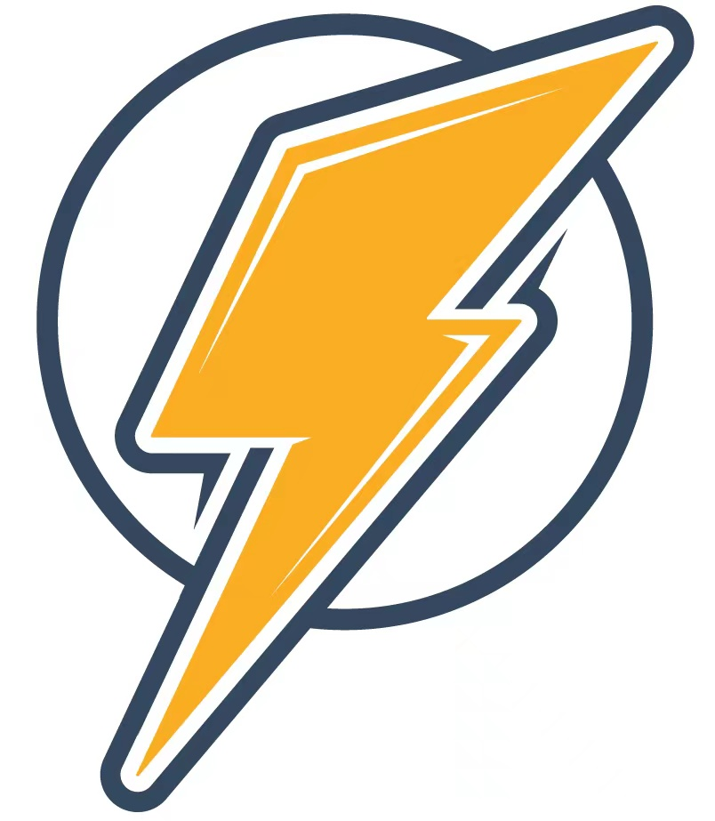

<div align="center">
  <h2><i>Unlocking Efficiency in Large Language Model Inference:</i><br>A Comprehensive Survey of Speculative Decoding</h2> 
</div>


<div align="center">
<b>Heming Xia</b><sup>1</sup>,
<b>Zhe Yang</b><sup>2</sup>,
<b>Qingxiu Dong</b><sup>2</sup>,
<b>Peiyi Wang</b><sup>2</sup>,
<b>Yongqi Li</b><sup>1</sup>,
<b>Tao Ge</b><sup>3</sup>,
<b>Tianyu Liu</b><sup>4</sup>,
<b>Wenjie Li</b><sup>1</sup>,
<b>Zhifang Sui</b><sup>2</sup>
</div>


<div align="center">
<sup>1</sup>Department of Computing, The Hong Kong Polytechnic University
</div>
<div align="center">
<sup>2</sup>National Key Laboratory for Multimedia Information Processing, Peking University
</div>
<div align="center">
<sup>3</sup>Microsoft Research Asia <sup>4</sup>Alibaba Group
</div>


This repository contains a regularly updated paper list for **Speculative Decoding**.

[](https://aclanthology.org/2024.findings-acl.456.pdf) [](https://awesome.re) [](./LICENSE) 

## Content

- [Keywords Convention](#keywords-convention)
- [Tutorial](#tutorial)
- [Papers](#papers)
  - [Survey](#survey)
  - [Speculative Decoding for Seq2Seq](#speculative-decoding-for-seq2seq)
  - [Speculative Decoding for LLMs](#speculative-decoding-for-llms)
  - [Multi-Token Prediction](#multi-token-prediction)
  - [Speculative Decoding for Diffusion LMs](#speculative-decoding-for-diffusion-lms)
  - [Multimodal Speculative Decoding](#multimodal-speculative-decoding)
  - [Long-Context Speculative Decoding](#long-context-speculative-decoding)
  - [Speculative Decoding for Mixture-of-Experts](#speculative-decoding-for-mixture-of-experts)
  - [Alignment](#alignment)
  - [Benchmarks](#benchmarks)
  - [Applications](#applications)
  - [Analysis](#analysis)
  - [Other Techniques](#other-techniques)
- [Blogs](#blog--project)
- [Contribution](#contribution)
  - [Contributors](#contributors)
  - [Contributing to this paper list](#contributing-to-this-paper-list)
- [Citation](#citation)

## Keywords Convention

 Abbreviation

 Conference

 Drafting Methods in Speculative Decoding

 Main Features

## Tutorial

- **Speculative Decoding for Efficient LLM Inference**  
  *Heming Xia, Cunxiao Du, Yongqi Li, Qian Liu and Wenjie Li.* [[homepage](https://speculative-decoding.github.io/)], [[slides](https://tinyurl.com/speculative-decoding-tutorial)], [[video](https://tinyurl.com/spec-tutorial-recording)], 2025.01.  

## Papers

### Survey

- **Unlocking Efficiency in Large Language Model Inference: A Comprehensive Survey of Speculative Decoding**  
  *Heming Xia, Zhe Yang, Qingxiu Dong, Peiyi Wang, Yongqi Li, Tao Ge, Tianyu Liu, Wenjie Li, Zhifang Sui.* [[pdf](https://aclanthology.org/2024.findings-acl.456.pdf)], [[code](https://github.com/hemingkx/Spec-Bench)], 2024.01.  
- **Beyond the Speculative Game: A Survey of Speculative Execution in Large Language Models**  
  *Chen Zhang, Zhuorui Liu, Dawei Song.* [[pdf](https://arxiv.org/pdf/2404.14897.pdf)], 2024.04. 
- **Closer Look at Efficient Inference Methods: A Survey of Speculative Decoding**  
  *Hyun Ryu, Eric Kim.* [[pdf](https://arxiv.org/pdf/2411.13157)], 2024.11. 
- **Speculative Decoding and Beyond: An In-Depth Review of Techniques**  
  *Yunhai Hu, Zining Liu, Zhenyuan Dong, Tianfan Peng, Bradley McDanel, Sai Qian Zhang.* [[pdf](https://arxiv.org/pdf/2502.19732)], 2025.02. 
- **A Survey on Parallel Text Generation: From Parallel Decoding to Diffusion Language Models**  
  *Lingzhe Zhang, Liancheng Fang, Chiming Duan, Minghua He, Leyi Pan, Pei Xiao, Shiyu Huang, Yunpeng Zhai, Xuming Hu, Philip S. Yu, Aiwei Liu.* [[pdf](https://arxiv.org/pdf/2508.08712)], 2025.08. 

### Speculative Decoding for Seq2Seq

- **Blockwise Parallel Decoding for Deep Autoregressive Models**  
  *Mitchell Stern, Noam Shazeer, Jakob Uszkoreit*. [[pdf](https://arxiv.org/pdf/1811.03115.pdf)], 2018.11.   
- **Speculative Decoding: Exploiting Speculative Execution for Accelerating Seq2seq Generation**  
  *Heming Xia, Tao Ge, Peiyi Wang, Si-Qing Chen, Furu Wei, Zhifang Sui*. [[pdf](https://aclanthology.org/2023.findings-emnlp.257.pdf)], [[code](https://github.com/hemingkx/SpecDec)], 2022.03.   
- **Speculative Decoding with Big Little Decoder**  
  *Sehoon Kim, Karttikeya Mangalam, Suhong Moon, John Canny, Jitendra Malik, Michael W. Mahoney, Amir Gholami, Kurt Keutzer*. [[pdf](https://openreview.net/pdf?id=EfMyf9MC3t)], [[code](https://github.com/kssteven418/BigLittleDecoder)], 2023.02.   
- **Accelerating Transformer Inference for Translation via Parallel Decoding**  
  *Andrea Santilli, Silvio Severino, Emilian Postolache, Valentino Maiorca, Michele Mancusi, Riccardo Marin, Emanuele Rodolà*. [[pdf](https://aclanthology.org/2023.acl-long.689.pdf)], 2023.05.  
- **SPEED: Speculative Pipelined Execution for Efficient Decoding**  
  *Coleman Hooper, Sehoon Kim, Hiva Mohammadzadeh, Hasan Genc, Kurt Keutzer, Amir Gholami, Sophia Shao*. [[pdf](https://arxiv.org/pdf/2310.12072.pdf)], 2023.10.   
- **Fast and Robust Early-Exiting Framework for Autoregressive Language Models with Synchronized Parallel Decoding**  
  *Sangmin Bae, Jongwoo Ko, Hwanjun Song, Se-Young Yun*. [[pdf](https://aclanthology.org/2023.emnlp-main.362.pdf)], [[code](https://github.com/raymin0223/fast_robust_early_exit)], 2023.10.   

### Speculative Decoding for LLMs

- **Fast Inference from Transformers via Speculative Decoding**  
  *Yaniv Leviathan, Matan Kalman, Yossi Matias*. [[pdf](https://arxiv.org/pdf/2211.17192.pdf)], [[code](https://github.com/feifeibear/LLMSpeculativeSampling)], 2022.11.  
- **Accelerating Large Language Model Decoding with Speculative Sampling**  
  *Charlie Chen, Sebastian Borgeaud, Geoffrey Irving, Jean-Baptiste Lespiau, Laurent Sifre, John Jumper*. [[pdf](http://arxiv.org/abs/2302.01318)], [[code](https://github.com/feifeibear/LLMSpeculativeSampling)], 2023.02.    
- **Inference with Reference: Lossless Acceleration of Large Language Models**  
  *Nan Yang, Tao Ge, Liang Wang, Binxing Jiao, Daxin Jiang, Linjun Yang, Rangan Majumder, Furu Wei.* [[pdf](https://arxiv.org/pdf/2304.04487.pdf)], 2023.04.   
- **SpecInfer: Accelerating Generative LLM Serving with Speculative Inference and Token Tree Verification**  
  *Xupeng Miao, Gabriele Oliaro, Zhihao Zhang, Xinhao Cheng, Zeyu Wang, Rae Ying Yee Wong, Alan Zhu, Lijie Yang, Xiaoxiang Shi, Chunan Shi, Zhuoming Chen, Daiyaan Arfeen, Reyna Abhyankar, Zhihao Jia.* [[pdf](https://arxiv.org/pdf/2305.09781.pdf)], [[code](https://github.com/flexflow/FlexFlow/)], 2023.05.   
- **Predictive Pipelined Decoding: A Compute-Latency Trade-off for Exact LLM Decoding**  
  *Seongjun Yang, Gibbeum Lee, Jaewoong Cho, Dimitris Papailiopoulos, Kangwook Lee*. [[pdf](https://arxiv.org/pdf/2307.05908.pdf)], 2023.08.   
- **Accelerating LLM Inference with Staged Speculative Decoding**  
  *Benjamin Spector, Chris Re*. [[pdf](https://arxiv.org/pdf/2308.04623.pdf)], 2023.08.  
- **SpecTr: Fast Speculative Decoding via Optimal Transport**   
  *Ziteng Sun, Ananda Theertha Suresh, Jae Hun Ro, Ahmad Beirami, Himanshu Jain, Felix Yu, Michael Riley, Sanjiv Kumar*. [[pdf](https://openreview.net/pdf?id=SdYHLTCC5J)], 2023.08.   
- **Draft & Verify: Lossless Large Language Model Acceleration via Self-Speculative Decoding**  
  *Jun Zhang, Jue Wang, Huan Li, Lidan Shou, Ke Chen, Gang Chen, Sharad Mehrotra*. [[pdf](https://arxiv.org/pdf/2309.08168.pdf)], [[code](https://github.com/dilab-zju/self-speculative-decoding)], 2023.09.   
- **Online Speculative Decoding**  
  *Xiaoxuan Liu, Lanxiang Hu, Peter Bailis, Ion Stoica, Zhijie Deng, Alvin Cheung, Hao Zhang*. [[pdf](https://arxiv.org/pdf/2310.07177.pdf)], 2023.10.  
- **DistillSpec: Improving Speculative Decoding via Knowledge Distillation**  
  *Yongchao Zhou, Kaifeng Lyu, Ankit Singh Rawat, Aditya Krishna Menon, Afshin Rostamizadeh, Sanjiv Kumar, Jean-François Kagy, Rishabh Agarwal.* [[pdf](https://arxiv.org/pdf/2310.08461.pdf)], 2023.10.    
- **REST: Retrieval-Based Speculative Decoding**  
  *Zhenyu He, Zexuan Zhong, Tianle Cai, Jason D Lee, Di He.* [[pdf](https://arxiv.org/pdf/2311.08252.pdf)], [[code](https://github.com/FasterDecoding/REST)], 2023.11.   
- **Speculative Contrastive Decoding**  
  *Hongyi Yuan, Keming Lu, Fei Huang, Zheng Yuan, Chang Zhou.* [[pdf](https://aclanthology.org/2024.acl-short.5.pdf)], 2023.11.   
- **PaSS: Parallel Speculative Sampling**  
  *Giovanni Monea, Armand Joulin, Edouard Grave.* [[pdf](https://arxiv.org/pdf/2311.13581.pdf)], 2023.11.   
- **Cascade Speculative Drafting for Even Faster LLM Inference**  
  *Ziyi Chen, Xiaocong Yang, Jiacheng Lin, Chenkai Sun, Jie Huang, Kevin Chen-Chuan Chang.* [[pdf](https://arxiv.org/pdf/2312.11462.pdf)], [[code](https://github.com/lfsszd/CS-Drafting)], 2023.12.  
- **SLiM: Speculative Decoding with Hypothesis Reduction**  
  *Hongxia Jin, Chi-Heng Lin, Shikhar Tuli, James Seale Smith, Yen-Chang Hsu, Yilin Shen*. [[pdf](https://openreview.net/pdf?id=aPOFpNWwzl)], 2023.12.   
- **Graph-Structured Speculative Decoding**  
  *Zhuocheng Gong, Jiahao Liu, Ziyue Wang, Pengfei Wu, Jingang Wang, Xunliang Cai, Dongyan Zhao, Rui Yan*. [[pdf](https://openreview.net/pdf?id=KSq0Gwyl_sL)], 2023.12.   
- **Multi-Candidate Speculative Decoding**  
  *Sen Yang, Shujian Huang, Xinyu Dai, Jiajun Chen.* [[pdf](https://arxiv.org/pdf/2401.06706.pdf)], [[code](https://github.com/NJUNLP/MCSD)], 2024.01.  
- **Medusa: Simple LLM Inference Acceleration Framework with Multiple Decoding Heads**  
  *Tianle Cai, Yuhong Li, Zhengyang Geng, Hongwu Peng, Jason D. Lee, Deming Chen, Tri Dao.* [[pdf](https://arxiv.org/pdf/2401.10774.pdf)], [[code](https://github.com/FasterDecoding/Medusa)], 2024.01.   
- **BiTA: Bi-Directional Tuning for Lossless Acceleration in Large Language Models**  
  *Feng Lin, Hanling Yi, Hongbin Li, Yifan Yang, Xiaotian Yu, Guangming Lu, Rong Xiao*. [[pdf](https://arxiv.org/pdf/2401.12522.pdf)], [[code](https://github.com/linfeng93/BiTA)], 2024.01.   
- **EAGLE: Speculative Sampling Requires Rethinking Feature Uncertainty**  
  *Yuhui Li, Fangyun Wei, Chao Zhang, Hongyang Zhang*. [[pdf](https://arxiv.org/pdf/2401.15077.pdf)], [[code](https://github.com/SafeAILab/EAGLE)], 2024.01.   
- **GliDe with a CaPE: A Low-Hassle Method to Accelerate Speculative Decoding**  
  *Cunxiao Du, Jing Jiang, Xu Yuanchen, Jiawei Wu, Sicheng Yu, Yongqi Li, Shenggui Li, Kai Xu, Liqiang Nie, Zhaopeng Tu, Yang You*. [[pdf](https://arxiv.org/pdf/2402.02082.pdf)], [[code](https://github.com/NonvolatileMemory/GliDe_with_a_CaPE_ICML_24)], 2024.02.   
- **Break the Sequential Dependency of LLM Inference Using Lookahead Decoding**  
  *Yichao Fu, Peter Bailis, Ion Stoica, Hao Zhang*. [[pdf](https://arxiv.org/pdf/2402.02057.pdf)], [[code](https://github.com/hao-ai-lab/LookaheadDecoding)], 2024.02.   
- **Hydra: Sequentially-Dependent Draft Heads for Medusa Decoding**  
  *Zachary Ankner, Rishab Parthasarathy, Aniruddha Nrusimha, Christopher Rinard, Jonathan Ragan-Kelley, William Brandon*. [[pdf](https://arxiv.org/pdf/2402.05109.pdf)], [[code](https://github.com/zankner/hydra)], 2024.02.   
- **Speculative Streaming: Fast LLM Inference without Auxiliary Models**  
  *Nikhil Bhendawade, Irina Belousova, Qichen Fu, Henry Mason, Mohammad Rastegari, Mahyar Najibi*. [[pdf](https://arxiv.org/pdf/2402.11131.pdf)], 2024.02.   
- **Generation Meets Verification: Accelerating Large Language Model Inference with Smart Parallel Auto-Correct Decoding**  
  *Hanling Yi, Feng Lin, Hongbin Li, Peiyang Ning, Xiaotian Yu, Rong Xiao*. [[pdf](https://arxiv.org/pdf/2402.11809.pdf)], 2024.02.   
- **Sequoia: Scalable, Robust, and Hardware-aware Speculative Decoding**  
  *Zhuoming Chen, Avner May, Ruslan Svirschevski, Yuhsun Huang, Max Ryabinin, Zhihao Jia, Beidi Chen*. [[pdf](https://arxiv.org/pdf/2402.12374.pdf)], [[code](https://github.com/Infini-AI-Lab/Sequoia)], 2024.02.   
- **ProPD: Dynamic Token Tree Pruning and Generation for LLM Parallel Decoding**  
  *Shuzhang Zhong, Zebin Yang, Meng Li, Ruihao Gong, Runsheng Wang, Ru Huang*. [[pdf](https://arxiv.org/pdf/2402.13485.pdf)], 2024.02.   
- **Ouroboros: Speculative Decoding with Large Model Enhanced Drafting**  
  *Weilin Zhao, Yuxiang Huang, Xu Han, Chaojun Xiao, Zhiyuan Liu, Maosong Sun*. [[pdf](https://arxiv.org/pdf/2402.13720.pdf)], [[code](https://github.com/thunlp/Ouroboros)], 2024.02.   
- **Recursive Speculative Decoding: Accelerating LLM Inference via Sampling Without Replacement**  
  *Wonseok Jeon, Mukul Gagrani, Raghavv Goel, Junyoung Park, Mingu Lee, Christopher Lott*. [[pdf](https://arxiv.org/pdf/2402.14160.pdf)], 2024.02.   
- **Chimera: A Lossless Decoding Method for Accelerating Large Language Models Inference by Fusing all Tokens**  
  *Ziqian Zeng, Jiahong Yu, Qianshi Pang, Zihao Wang, Huiping Zhuang, Cen Chen*. [[pdf](https://arxiv.org/pdf/2402.15758.pdf)], 2024.02.   
- **Speculative Decoding via Early-exiting for Faster LLM Inference with Thompson Sampling Control Mechanism**  
  *Jiahao Liu, Qifan Wang, Jingang Wang, Xunliang Cai*. [[pdf](https://arxiv.org/pdf/2406.03853)], 2024.02.   
- **Minions: Accelerating Large Language Model Inference with Adaptive and Collective Speculative Decoding**  
  *Siqi Wang, Hailong Yang, Xuezhu Wang, Tongxuan Liu, Pengbo Wang, Xuning Liang, Kejie Ma, Tianyu Feng, Xin You, Yongjun Bao, Yi Liu, Zhongzhi Luan, Depei Qian*. [[pdf](https://arxiv.org/pdf/2402.15678.pdf)], 2024.02.  
- **CLLMs: Consistency Large Language Models**  
  *Siqi Kou, Lanxiang Hu, Zhezhi He, Zhijie Deng, Hao Zhang*. [[pdf](https://arxiv.org/pdf/2403.00835.pdf)], [[code](https://github.com/hao-ai-lab/Consistency_LLM)], [[blog](https://hao-ai-lab.github.io/blogs/cllm/)], 2024.03.   
- **Recurrent Drafter for Fast Speculative Decoding in Large Language Models**  
  *Aonan Zhang, Chong Wang, Yi Wang, Xuanyu Zhang, Yunfei Cheng*. [[pdf](https://arxiv.org/pdf/2403.09919.pdf)], 2024.03.   
- **Block Verification Accelerates Speculative Decoding**  
  *Ziteng Sun, Uri Mendlovic, Yaniv Leviathan, Asaf Aharoni, Ahmad Beirami, Jae Hun Ro, Ananda Theertha Suresh*. [[pdf](https://arxiv.org/pdf/2403.10444.pdf)], 2024.03.  
- **SDSAT: Accelerating LLM Inference through Speculative Decoding with Semantic Adaptive Tokens**  
  *Chengbo Liu, Yong Zhu*. [[pdf](https://arxiv.org/pdf/2403.18647.pdf)], 2024.03.   
- **Lossless Acceleration of Large Language Model via Adaptive N-gram Parallel Decoding**  
  *Jie Ou, Yueming Chen, Wenhong Tian*. [[pdf](https://aclanthology.org/2024.naacl-industry.2.pdf)], 2024.04.   
- **Accelerating Blockwise Parallel Language Models with Draft Refinement**  
  *Taehyeon Kim, Ananda Theertha Suresh, Kishore Papineni, Michael Riley, Sanjiv Kumar, Adrian Benton*. [[pdf](https://openreview.net/pdf?id=KT6F5Sw0eg)], 2024.04.  
- **Parallel Decoding via Hidden Transfer for Lossless Large Language Model Acceleration**  
  *Pengfei Wu, Jiahao Liu, Zhuocheng Gong, Qifan Wang, Jinpeng Li, Jingang Wang, Xunliang Cai, Dongyan Zhao*. [[pdf](https://arxiv.org/pdf/2404.12022.pdf)], 2024.04.  
- **BASS: Batched Attention-optimized Speculative Sampling**  
  *Haifeng Qian, Sujan Kumar Gonugondla, Sungsoo Ha, Mingyue Shang, Sanjay Krishna Gouda, Ramesh Nallapati, Sudipta Sengupta, Xiaofei Ma, Anoop Deoras*. [[pdf](https://arxiv.org/pdf/2404.15778.pdf)], 2024.04.    
- **LayerSkip: Enabling Early Exit Inference and Self-Speculative Decoding**  
  *Mostafa Elhoushi, Akshat Shrivastava, Diana Liskovich, Basil Hosmer, Bram Wasti, Liangzhen Lai, Anas Mahmoud, Bilge Acun, Saurabh Agarwal, Ahmed Roman, Ahmed A Aly, Beidi Chen, Carole-Jean Wu*. [[pdf](https://arxiv.org/pdf/2404.16710)], 2024.04.    
- **Kangaroo: Lossless Self-Speculative Decoding via Double Early Exiting**  
  *Fangcheng Liu, Yehui Tang, Zhenhua Liu, Yunsheng Ni, Kai Han, Yunhe Wang*. [[pdf](https://arxiv.org/pdf/2404.18911)], [[code](https://github.com/Equationliu/Kangaroo)], 2024.04.   
- **Accelerating Production LLMs with Combined Token/Embedding Speculators**  
  *Davis Wertheimer, Joshua Rosenkranz, Thomas Parnell, Sahil Suneja, Pavithra Ranganathan, Raghu Ganti, Mudhakar Srivatsa*. [[pdf](https://arxiv.org/pdf/2404.19124)], 2024.04.  
- **Clover: Regressive Lightweight Speculative Decoding with Sequential Knowledge**  
  *Bin Xiao, Chunan Shi, Xiaonan Nie, Fan Yang, Xiangwei Deng, Lei Su, Weipeng Chen, Bin Cui*. [[pdf](https://arxiv.org/pdf/2405.00263)], 2024.05.   
- **Accelerating Speculative Decoding using Dynamic Speculation Length**  
  *Jonathan Mamou, Oren Pereg, Daniel Korat, Moshe Berchansky, Nadav Timor, Moshe Wasserblat, Roy Schwartz*. [[pdf](https://arxiv.org/pdf/2405.04304)], 2024.05.  
- **EMS-SD: Efficient Multi-sample Speculative Decoding for Accelerating Large Language Models**  
  *Yunsheng Ni, Chuanjian Liu, Yehui Tang, Kai Han, Yunhe Wang*. [[pdf](https://arxiv.org/pdf/2405.07542)], [[code](https://github.com/niyunsheng/EMS-SD)], 2024.05.   
- **Nearest Neighbor Speculative Decoding for LLM Generation and Attribution**  
  *Minghan Li, Xilun Chen, Ari Holtzman, Beidi Chen, Jimmy Lin, Wen-tau Yih, Xi Victoria Lin*. [[pdf](https://arxiv.org/pdf/2405.19325)], 2024.05.   
- **Hardware-Aware Parallel Prompt Decoding for Memory-Efficient Acceleration of LLM Inference**  
  *Hao (Mark)Chen, Wayne Luk, Ka Fai Cedric Yiu, Rui Li, Konstantin Mishchenko, Stylianos I. Venieris, Hongxiang Fan*. [[pdf](https://arxiv.org/pdf/2405.18628)], [[code](https://github.com/hmarkc/parallel-prompt-decoding)], 2024.05.   
- **Faster Cascades via Speculative Decoding**  
  *Harikrishna Narasimhan, Wittawat Jitkrittum, Ankit Singh Rawat, Seungyeon Kim, Neha Gupta, Aditya Krishna Menon, Sanjiv Kumar*. [[pdf](https://arxiv.org/pdf/2405.19261)], 2024.05.   
- **S3D: A Simple and Cost-Effective Self-Speculative Decoding Scheme for Low-Memory GPUs**  
  *Wei Zhong, Manasa Bharadwaj*. [[pdf](https://arxiv.org/pdf/2405.20314)], 2024.05.   
- **SpecDec++: Boosting Speculative Decoding via Adaptive Candidate Lengths**  
  *Kaixuan Huang, Xudong Guo, Mengdi Wang*. [[pdf](https://arxiv.org/pdf/2405.19715)], 2024.05.   
- **Distributed Speculative Inference of Large Language Models**  
  *Nadav Timor, Jonathan Mamou, Daniel Korat, Moshe Berchansky, Oren Pereg, Moshe Wasserblat, Tomer Galanti, Michal Gordon*. [[pdf](https://arxiv.org/pdf/2405.14105v1)], 2024.05.  
- **Accelerated Speculative Sampling Based on Tree Monte Carlo**  
  *Zhengmian Hu, Heng Huang*. [[pdf](https://openreview.net/pdf?id=stMhi1Sn2G)], 2024.05.   
- **SpecExec: Massively Parallel Speculative Decoding for Interactive LLM Inference on Consumer Devices**  
  *Ruslan Svirschevski, Avner May, Zhuoming Chen, Beidi Chen, Zhihao Jia, Max Ryabinin*. [[pdf](https://arxiv.org/pdf/2406.02532)], 2024.06.  
- **Amphista: Accelerate LLM Inference with Bi-directional Multiple Drafting Heads in a Non-autoregressive Style**  
  *Zeping Li, Xinlong Yang, Ziheng Gao, Ji Liu, Zhuang Liu, Dong Li, Jinzhang Peng, Lu Tian, Emad Barsoum*. [[pdf](https://arxiv.org/pdf/2406.13170)], 2024.06.   
- **Optimizing Speculative Decoding for Serving Large Language Models Using Goodput**  
  *Xiaoxuan Liu, Cade Daniel, Langxiang Hu, Woosuk Kwon, Zhuohan Li, Xiangxi Mo, Alvin Cheung, Zhijie Deng, Ion Stoica, Hao Zhang*. [[pdf](https://arxiv.org/pdf/2406.14066)], 2024.06.    
- **EAGLE-2: Faster Inference of Language Models with Dynamic Draft Trees**  
  *Yuhui Li, Fangyun Wei, Chao Zhang, Hongyang Zhang*. [[pdf](https://arxiv.org/pdf/2406.16858)], 2024.06.    
- **Context-Aware Assistant Selection for Improved Inference Acceleration with Large Language Models**  
  *Jerry Huang, Prasanna Parthasarathi, Mehdi Rezagholizadeh, Sarath Chandar*. [[pdf](https://aclanthology.org/2024.emnlp-main.332.pdf)], 2024.06.  
- **Make Some Noise: Unlocking Language Model Parallel Inference Capability through Noisy Training**  
  *Yixuan Wang, Xianzhen Luo, Fuxuan Wei, Yijun Liu, Qingfu Zhu, Xuanyu Zhang, Qing Yang, Dongliang Xu, Wanxiang Che*. [[pdf](https://arxiv.org/pdf/2406.17404)], 2024.06.   
- **OPT-Tree: Speculative Decoding with Adaptive Draft Tree Structure**  
  *Jikai Wang, Yi Su, Juntao Li, Qinrong Xia, Zi Ye, Xinyu Duan, Zhefeng Wang, Min Zhang*. [[pdf](https://arxiv.org/pdf/2406.17276)], 2024.06.   
- **Cerberus: Efficient Inference with Adaptive Parallel Decoding and Sequential Knowledge Enhancement**  
  *Yuxuan Liu, Wenyuan Li, Laizhong Cui, Hailiang Yang*. [[pdf](https://arxiv.org/pdf/2410.13344)], 2024.06.  
- **SpecHub: Provable Acceleration to Multi-Draft Speculative Decoding**  
  *Ryan Sun, Tianyi Zhou, Xun Chen, Lichao Sun*. [[pdf](https://aclanthology.org/2024.emnlp-main.1148.pdf)], 2024.06.  
- **S2D: Sorted Speculative Decoding For More Efficient Deployment of Nested Large Language Models**  
  *Parsa Kavehzadeh, Mohammadreza Pourreza, Mojtaba Valipour, Tinashu Zhu, Haoli Bai, Ali Ghodsi, Boxing Chen, Mehdi Rezagholizadeh*. [[pdf](https://arxiv.org/pdf/2407.01955)], 2024.07.  
- **Multi-Token Joint Speculative Decoding for Accelerating Large Language Model Inference**  
  *Zongyue Qin, Ziniu Hu, Zifan He, Neha Prakriya, Jason Cong, Yizhou Sun*. [[pdf](https://arxiv.org/pdf/2407.09722)], 2024.07.  
- **PipeInfer: Accelerating LLM Inference using Asynchronous Pipelined Speculation**  
  *Branden Butler, Sixing Yu, Arya Mazaheri, Ali Jannesari*. [[pdf](https://arxiv.org/pdf/2407.11798)], 2024.07.  
- **Adaptive Draft-Verification for Efficient Large Language Model Decoding**  
  *Xukun Liu, Bowen Lei, Ruqi Zhang, Dongkuan Xu*. [[pdf](https://arxiv.org/pdf/2407.12021)], 2024.07.  
- **Graph-Structured Speculative Decoding**  
  *Zhuocheng Gong, Jiahao Liu, Ziyue Wang, Pengfei Wu, Jingang Wang, Xunliang Cai, Dongyan Zhao, Rui Yan*. [[pdf](https://arxiv.org/pdf/2407.16207)], 2024.07.  
- **Inference acceleration for large language models using "stairs" assisted greedy generation**  
  *Domas Grigaliūnas, Mantas Lukoševičius*. [[pdf](https://arxiv.org/pdf/2407.19947)], 2024.07. 
- **Clover-2: Accurate Inference for Regressive Lightweight Speculative Decoding**  
  *Bin Xiao, Lujun Gui, Lei Su, Weipeng Chen*. [[pdf](https://arxiv.org/pdf/2408.00264)], [[code](https://github.com/XiaoBin1992/clover)], 2024.08.   
- **CREST: Effectively Compacting a Datastore For Retrieval-Based Speculative Decoding**  
  *Sophia Ho, Jinsol Park, Patrick Wang*. [[pdf](https://arxiv.org/pdf/2408.04678)], 2024.08.   
- **KOALA: Enhancing Speculative Decoding for LLM via Multi-Layer Draft Heads with Adversarial Learning**  
  *Kaiqi Zhang, Jing Zhao, Rui Chen*. [[pdf](https://arxiv.org/pdf/2408.08146)], 2024.08.    
- **Turning Trash into Treasure: Accelerating Inference of Large Language Models with Token Recycling**  
  *Xianzhen Luo, Yixuan Wang, Qingfu Zhu, Zhiming Zhang, Xuanyu Zhang, Qing Yang, Dongliang Xu, Wanxiang Che*. [[pdf](https://arxiv.org/pdf/2408.08696)], 2024.08.   
- **Parallel Speculative Decoding with Adaptive Draft Length**  
  *Tianyu Liu, Yun Li, Qitan Lv, Kai Liu, Jianchen Zhu, Winston Hu*. [[pdf](https://arxiv.org/pdf/2408.11850)], [[code](https://github.com/smart-lty/ParallelSpeculativeDecoding)], [[blog](https://pearl-code.github.io/)], 2024.08.  
- **Boosting Lossless Speculative Decoding via Feature Sampling and Partial Alignment Distillation**  
  *Lujun Gui, Bin Xiao, Lei Su, Weipeng Chen*. [[pdf](https://arxiv.org/pdf/2408.15562)], 2024.08.  
- **Harmonized Speculative Sampling**  
  *Lefan Zhang, Xiaodan Wang, Yanhua Huang, Ruiwen Xu*. [[pdf](https://arxiv.org/pdf/2408.15766)], 2024.08.  
- **Dynamic Depth Decoding: Faster Speculative Decoding for LLMs**  
  *Oscar Brown, Zhengjie Wang, Andrea Do, Nikhil Mathew, Cheng Yu*. [[pdf](https://arxiv.org/pdf/2409.00142)], 2024.08.  
- **The Mamba in the Llama: Distilling and Accelerating Hybrid Models**  
  *Junxiong Wang, Daniele Paliotta, Avner May, Alexander M. Rush, Tri Dao*. [[pdf](https://arxiv.org/pdf/2408.15237)], [[code](https://github.com/jxiw/MambaInLlama)], 2024.08.  
- **Improving Multi-candidate Speculative Decoding**  
  *Xiaofan Lu, Yixiao Zeng, Feiyang Ma, Zixu Yu, Marco Levorato*. [[pdf](https://arxiv.org/pdf/2409.10644)], 2024.10.  
- **Draft on the Fly: Adaptive Self-Speculative Decoding using Cosine Similarity**  
  *Michael R. Metel, Peng Lu, Boxing Chen, Mehdi Rezagholizadeh, Ivan Kobyzev*. [[pdf](https://arxiv.org/pdf/2410.01028)], 2024.10.  
- **Dynamic-Width Speculative Beam Decoding for Efficient LLM Inference**  
  *Zongyue Qin, Zifan He, Neha Prakriya, Jason Cong, Yizhou Sun*. [[pdf](https://arxiv.org/pdf/2409.16560)], 2024.10.  
- **Mixture of Attentions For Speculative Decoding**  
  *Matthieu Zimmer, Milan Gritta, Gerasimos Lampouras, Haitham Bou Ammar, Jun Wang*. [[pdf](https://arxiv.org/pdf/2410.03804)], 2024.10. 
- **SWIFT: On-the-Fly Self-Speculative Decoding for LLM Inference Acceleration**  
  *Heming Xia, Yongqi Li, Jun Zhang, Cunxiao Du, Wenjie Li*. [[pdf](https://arxiv.org/pdf/2410.06916)], [[code](https://github.com/hemingkx/SWIFT)], 2024.10.   
- **ParallelSpec: Parallel Drafter for Efficient Speculative Decoding**  
  *Zilin Xiao, Hongming Zhang, Tao Ge, Siru Ouyang, Vicente Ordonez, Dong Yu*. [[pdf](https://arxiv.org/pdf/2410.05589)], 2024.10.  
- **Polybasic Speculative Decoding Under a Theoretical Perspective**  
  *Ruilin Wang, Huixia Li, Yuexiao Ma, Xiawu Zheng, Fei Chao, Xuefeng Xiao, Rongrong Ji*. [[pdf](https://openreview.net/pdf?id=n7iwmPacDt)], 2024.10. 
- **Towards Optimal Multi-draft Speculative Decoding**  
  *Zhengmian Hu, Tong Zheng, Vignesh Viswanathan, Ziyi Chen, Ryan A. Rossi, Yihan Wu, Dinesh Manocha, Heng Huang*. [[pdf](https://openreview.net/pdf?id=9KxnxWOBA5)], 2024.10. 
- **A Unified Framework for Speculative Decoding with Multiple Drafters as a Bandit**  
  *Taehyeon Kim, Hojung Jung, Se-Young Yun*. [[pdf](https://openreview.net/attachment?id=5haYLrlyGj&name=pdf)], 2024.10.  
- **DySpec: Faster Speculative Decoding with Dynamic Token Tree Structure**  
  *Yunfan Xiong, Ruoyu Zhang, Yanzeng Li, Tianhao Wu, Lei Zou*. [[pdf](https://arxiv.org/pdf/2410.11744)], 2024.10.  
- **Judge Decoding: Faster Speculative Sampling Requires Going Beyond Model Alignment**  
  *Gregor Bachmann, Sotiris Anagnostidis, Albert Pumarola, Markos Georgopoulos, Artsiom Sanakoyeu, Yuming Du, Edgar Schönfeld, Ali Thabet, Jonas Kohler*. [[pdf](https://openreview.net/attachment?id=mtSSFiqW6y&name=pdf)], 2024.10. 
- **QSpec: Speculative Decoding with Complementary Quantization Schemes**  
  *Juntao Zhao, Wenhao Lu, Sheng Wang, Lingpeng Kong, Chuan Wu*. [[pdf](https://arxiv.org/pdf/2410.11305)], 2024.10.  
- **Multi-Draft Speculative Sampling: Canonical Architectures and Theoretical Limits**  
  *Ashish Khisti, M.Reza Ebrahimi, Hassan Dbouk, Arash Behboodi, Roland Memisevic, Christos Louizos*. [[pdf](https://arxiv.org/pdf/2410.18234)], 2024.10.  
- **CASD: Enhancing Generation Accuracy via Context-Aware Speculative Decoding**  
  *Jikai Wang, Zhenxu Tian, Juntao Li, Qingrong Xia, Xinyu Duan, Zhefeng Wang, Baoxing Huai, Min Zhang*. [[pdf](https://openreview.net/attachment?id=g3D27bfmrf&name=pdf)], 2024.10.  
- **A Drop-In Solution for On-the-Fly Adaptation of Speculative Decoding in Large Language Models**  
  *Jiesong Liu, Brian Park, Xipeng Shen*. [[pdf](https://openreview.net/attachment?id=xOtOfdbBqK&name=pdf)], 2024.10.  
- **Semi-autoregressive Decoding for Efficient LLM Inference**  
  *Yanzhi Chen, Menglin Xia, Wenbo Gong, Ankur Mallick, Srikant Bharadwaj, Metod Jazbec, Shoaib Ahmed Siddiqui, Adrian Weller, Victor Rühle*. [[pdf](https://openreview.net/attachment?id=gfDbD1MRYk&name=pdf)], 2024.10. 
- **Speculate, then Collaborate: Fusing Knowledge of Language Models during Decoding**  
  *Ziyao Wang, Muneeza Azmat, Ang Li, Raya Horesh, Mikhail Yurochkin*. [[pdf](https://arxiv.org/pdf/2502.08020)], 2024.10.  
- **Fast and Accurate Language Model Decoding via Parallel Token Processing**  
  *Zhepei Wei, Wei-Lin Chen, Xinyu Zhu, Yu Meng*. [[pdf](https://openreview.net/attachment?id=IRsxTYPqhQ&name=pdf)], 2024.10.  
- **AMUSD: Asynchronous Multi-Device Speculative Decoding for LLM Acceleration**  
  *Bradley McDanel*. [[pdf](https://arxiv.org/pdf/2410.17375)], [[code](https://github.com/BradMcDanel/AMUSD/)], 2024.10.  
- **AdaEDL: Early Draft Stopping for Speculative Decoding of Large Language Models via an Entropy-based Lower Bound on Token Acceptance Probability**  
  *Sudhanshu Agrawal, Wonseok Jeon, Mingu Lee*. [[pdf](https://arxiv.org/pdf/2410.18351)], 2024.10.  
- **FIRP: Faster LLM inference via future intermediate representation prediction**  
  *Pengfei Wu, Jiahao Liu, Zhuocheng Gong, Qifan Wang, Jinpeng Li, Jingang Wang, Xunliang Cai, Dongyan Zhao*. [[pdf](https://arxiv.org/pdf/2410.20488)], 2024.10.  
- **The N-Grammys: Accelerating Autoregressive Inference with Learning-Free Batched Speculation**  
  *Lawrence Stewart, Matthew Trager, Sujan Kumar Gonugondla, Stefano Soatto*. [[pdf](https://arxiv.org/pdf/2411.03786)], 2024.11. 
- **SuffixDecoding: A Model-Free Approach to Speeding Up Large Language Model Inference**  
  *Gabriele Oliaro, Zhihao Jia, Daniel Campos, Aurick Qiao*. [[pdf](https://arxiv.org/pdf/2411.04975)], [[code](https://github.com/snowflakedb/ArcticInference?tab=readme-ov-file)], [[homepage](https://suffix-decoding.github.io/)] [[vllm](https://docs.vllm.ai/en/stable/api/vllm/v1/spec_decode/suffix_decoding/)], 2024.11.   
- **SSSD: Simply-Scalable Speculative Decoding**  
  *Michele Marzollo, Jiawei Zhuang, Niklas Roemer, Lorenz K. Müller, Lukas Cavigelli*. [[pdf](https://arxiv.org/pdf/2411.05894)], 2024.11.  
- **FastDraft: How to Train Your Draft**  
  *Ofir Zafrir, Igor Margulis, Dorin Shteyman, Guy Boudoukh*. [[pdf](https://arxiv.org/pdf/2411.11055)], 2024.11.  
- **SAM Decoding: Speculative Decoding via Suffix Automaton**  
  *Yuxuan Hu, Ke Wang, Jing Zhang, Cuiping Li, Hong Chen*. [[pdf](https://arxiv.org/pdf/2411.10666)], 2024.11.  
- **Draft Model Knows When to Stop: A Self-Verification Length Policy for Speculative Decoding**  
  *Ziyin Zhang, Jiahao Xu, Tian Liang, Xingyu Chen, Zhiwei He, Rui Wang, Zhaopeng Tu*. [[pdf](https://arxiv.org/pdf/2411.18462)], 2024.11.  
- **PLD+: Accelerating LLM inference by leveraging Language Model Artifacts**  
  *Shwetha Somasundaram, Anirudh Phukan, Apoorv Saxena*. [[pdf](https://arxiv.org/pdf/2412.01447)], 2024.12.  
- **Speculative Decoding with CTC-based Draft Model for LLM Inference Acceleration**  
  *Zhuofan Wen, Shangtong Gui, Yang Feng*. [[pdf](https://arxiv.org/pdf/2412.00061)], 2024.12. 
- **Falcon: Faster and Parallel Inference of Large Language Models through Enhanced Semi-Autoregressive Drafting and Custom-Designed Decoding Tree**  
  *Xiangxiang Gao, Weisheng Xie, Yiwei Xiang, Feng Ji*. [[pdf](https://arxiv.org/pdf/2412.12639)], 2024.12.  
- **Dovetail: A CPU/GPU Heterogeneous Speculative Decoding for LLM inference**  
  *Libo Zhang, Zhaoning Zhang, Baizhou Xu, Songzhu Mei, Dongsheng Li*. [[pdf](https://arxiv.org/pdf/2412.18934)], 2024.12.  
- **AdaEAGLE: Optimizing Speculative Decoding via Explicit Modeling of Adaptive Draft Structures**  
  *Situo Zhang, Hankun Wang, Da Ma, Zichen Zhu, Lu Chen, Kunyao Lan, Kai Yu*. [[pdf](https://arxiv.org/pdf/2412.18910)], 2024.12.  
- **Reward-Guided Speculative Decoding for Efficient LLM Reasoning**  
  *Baohao Liao, Yuhui Xu, Hanze Dong, Junnan Li, Christof Monz, Silvio Savarese, Doyen Sahoo, Caiming Xiong*. [[pdf](https://arxiv.org/pdf/2501.19324)], 2025.01.   
- **Judge Decoding: Faster Speculative Sampling Requires Going Beyond Model Alignment**  
  *Gregor Bachmann, Sotiris Anagnostidis, Albert Pumarola, Markos Georgopoulos, Artsiom Sanakoyeu, Yuming Du, Edgar Schönfeld, Ali Thabet, Jonas Kohler*. [[pdf](https://arxiv.org/pdf/2501.19309)], 2025.01. 
- **EasySpec: Layer-Parallel Speculative Decoding for Efficient Multi-GPU Utilization**  
  *Yize Wu, Ke Gao, Yanjun Wu*. [[pdf](https://arxiv.org/pdf/2502.02493)], 2025.02.  
- **Speeding up Speculative Decoding via Approximate Verification**  
  *Meiyu Zhong, Noel Teku, Ravi Tandon*. [[pdf](https://arxiv.org/pdf/2502.04557)], 2025.02.  
- **Jakiro: Boosting Speculative Decoding with Decoupled Multi-Head via MoE**  
  *Haiduo Huang, Fuwei Yang, Zhenhua Liu, Yixing Xu, Jinze Li, Yang Liu, Xuanwu Yin, Dong Li, Pengju Ren, Emad Barsoum*. [[pdf](https://arxiv.org/pdf/2502.06282)], [[code](https://github.com/haiduo/Jakiro)], 2025.02.  
- **Lossless Acceleration of Large Language Models with Hierarchical Drafting based on Temporal Locality in Speculative Decoding**  
  *Sukmin Cho, Sangjin Choi, Taeho Hwang, Jeongyeon Seo, Soyeong Jeong, Huije Lee, Hoyun Song, Jong C. Park, Youngjin Kwon*. [[pdf](https://arxiv.org/pdf/2502.05609)], [[code](https://github.com/zomss/Hierarchy_Drafting)], 2025.02.  
- **Accelerating LLM Inference with Lossless Speculative Decoding Algorithms for Heterogeneous Vocabularies**  
  *Nadav Timor, Jonathan Mamou, Daniel Korat, Moshe Berchansky, Oren Pereg, Gaurav Jain, Roy Schwartz, Moshe Wasserblat, David Harel*. [[pdf](https://arxiv.org/pdf/2502.05202)], 2025.02. 
- **CopySpec: Accelerating LLMs with Speculative Copy-and-Paste**  
  *Razvan-Gabriel Dumitru, Minglai Yang, Vikas Yadav, Mihai Surdeanu*. [[pdf](https://arxiv.org/pdf/2502.08923)],  [[code](https://github.com/RazvanDu/CopySpec)], 2025.02.  
- **C2T: A Classifier-Based Tree Construction Method in Speculative Decoding**  
  *Feiye Huo, Jianchao Tan, Kefeng Zhang, Xunliang Cai, Shengli Sun*. [[pdf](https://arxiv.org/pdf/2502.13652)], 2025.02.  
- **FR-Spec: Accelerating Large-Vocabulary Language Models via Frequency-Ranked Speculative Sampling**  
  *Weilin Zhao, Tengyu Pan, Xu Han, Yudi Zhang, Ao Sun, Yuxiang Huang, Kaihuo Zhang, Weilun Zhao, Yuxuan Li, Jianyong Wang, Zhiyuan Liu, Maosong Sun*. [[pdf](https://arxiv.org/pdf/2502.14856)], 2025.02.  
- **GRIFFIN: Effective Token Alignment for Faster Speculative Decoding**  
  *Shijing Hu, Jingyang Li, Xingyu Xie, Zhihui Lu, Kim-Chuan Toh, Pan Zhou*. [[pdf](https://arxiv.org/pdf/2502.11018)], [[code](https://github.com/hsj576/GRIFFIN)], 2025.02.  
- **DReSD: Dense Retrieval for Speculative Decoding**  
  *Milan Gritta, Huiyin Xue, Gerasimos Lampouras*. [[pdf](https://arxiv.org/pdf/2502.15572)], 2025.02.  
- **TETRIS: Optimal Draft Token Selection for Batch Speculative Decoding**  
  *Zhaoxuan Wu, Zijian Zhou, Arun Verma, Alok Prakash, Daniela Rus, Bryan Kian Hsiang Low*. [[pdf](https://arxiv.org/pdf/2502.15197)], 2025.02.  
- **CORAL: Learning Consistent Representations across Multi-step Training with Lighter Speculative Drafter**  
  *Yepeng Weng, Dianwen Mei, Huishi Qiu, Xujie Chen, Li Liu, Jiang Tian, Zhongchao Shi*. [[pdf](https://arxiv.org/pdf/2502.16880)], 2025.02.  
- **Fuzzy Speculative Decoding for a Tunable Accuracy-Runtime Tradeoff**  
  *Maximilian Holsman, Yukun Huang, Bhuwan Dhingra*. [[pdf](https://www.arxiv.org/pdf/2502.20704)], 2025.02.  
- **EAGLE-3: Scaling up Inference Acceleration of Large Language Models via Training-Time Test**  
  *Yuhui Li, Fangyun Wei, Chao Zhang, Hongyang Zhang*. [[pdf](https://arxiv.org/pdf/2503.01840)], [[code](https://github.com/SafeAILab/EAGLE)], 2025.03.  
- **DuoDecoding: Hardware-aware Heterogeneous Speculative Decoding with Dynamic Multi-Sequence Drafting**  
  *Kai Lv, Honglin Guo, Qipeng Guo, Xipeng Qiu*. [[pdf](https://arxiv.org/pdf/2503.00784)], [[code](https://github.com/KaiLv69/DuoDecoding)], 2025.03.  
- **RASD: Retrieval-Augmented Speculative Decoding**  
  *Guofeng Quan, Wenfeng Feng, Chuzhan Hao, Guochao Jiang, Yuewei Zhang, Hao Wang*. [[pdf](https://arxiv.org/pdf/2503.03434)], 2025.03.  
- **Speculative Decoding for Multi-Sample Inference**  
  *Yiwei Li, Jiayi Shi, Shaoxiong Feng, Peiwen Yuan, Xinglin Wang, Yueqi Zhang, Ji Zhang, Chuyi Tan, Boyuan Pan, Yao Hu, Kan Li*. [[pdf](https://arxiv.org/pdf/2503.05330)], 2025.03. 
- **SpecServe: Efficient and SLO-Aware Large Language Model Serving with Adaptive Speculative Decoding**  
  *Kaiyu Huang, Hao Wu, Zhubo Shi, Han Zou, Minchen Yu, Qingjiang Shi*. [[pdf](https://arxiv.org/pdf/2503.05096)], 2025.03.  
- **Training Domain Draft Models for Speculative Decoding: Best Practices and Insights**  
  *Fenglu Hong, Ravi Raju, Jonathan Lingjie Li, Bo Li, Urmish Thakker, Avinash Ravichandran, Swayambhoo Jain, Changran Hu*. [[pdf](https://arxiv.org/pdf/2503.07807)], 2025.03. 
- **Gumiho: A Hybrid Architecture to Prioritize Early Tokens in Speculative Decoding**  
  *Jinze Li, Yixing Xu, Haiduo Huang, Xuanwu Yin, Dong Li, Edith C.H. Ngai, Emad Barsoum*. [[pdf](https://arxiv.org/pdf/2503.10135)], 2025.03.  
- **ML-SpecQD: Multi-Level Speculative Decoding with Quantized Drafts**  
  *Evangelos Georganas, Dhiraj Kalamkar, Alexander Kozlov, Alexander Heinecke*. [[pdf](https://arxiv.org/pdf/2503.13565)], 2025.03.  
- **SPIN: Accelerating Large Language Model Inference with Heterogeneous Speculative Models**  
  *Fahao Chen, Peng Li, Tom H. Luan, Zhou Su, Jing Deng*. [[pdf](https://arxiv.org/pdf/2503.15921)], 2025.03.  
- **DEL: Context-Aware Dynamic Exit Layer for Efficient Self-Speculative Decoding**  
  *Hossein Entezari Zarch, Lei Gao, Chaoyi Jiang, Murali Annavaram*. [[pdf](https://arxiv.org/pdf/2504.05598)], [[code](https://github.com/hoenza/DEL)], 2025.04.  
- **SD$^2$: Self-Distilled Sparse Drafters**  
  *Mike Lasby, Nish Sinnadurai, Valavan Manohararajah, Sean Lie, Vithursan Thangarasa*. [[pdf](https://arxiv.org/pdf/2504.08838)], 2025.04.  
- **SpecEE: Accelerating Large Language Model Inference with Speculative Early Exiting**  
  *Jiaming Xu, Jiayi Pan, Yongkang Zhou, Siming Chen, Jinhao Li, Yaoxiu Lian, Junyi Wu, Guohao Dai*. [[pdf](https://arxiv.org/pdf/2504.08850)], 2025.04.  
- **Speculative Sampling via Exponential Races**  
  *Szymon Kobus, Deniz Gündüz*. [[pdf](https://arxiv.org/pdf/2504.15475)], 2025.04.  
- **AutoJudge: Judge Decoding Without Manual Annotation**  
  *Roman Garipov, Fedor Velikonivtsev, Ruslan Svirschevski, Vage Egiazarian, Max Ryabinin*. [[pdf](https://arxiv.org/pdf/2504.20039)], [[code](https://github.com/garipovroma/autojudge)], 2025.04.  
- **PARD: Accelerating LLM Inference with Low-Cost PARallel Draft Model Adaptation**  
  *Zihao An, Huajun Bai, Ziqiong Liu, Dong Li, Emad Barsoum*. [[pdf](https://arxiv.org/pdf/2504.18583)], 2025.04.  
- **PipeSpec: Breaking Stage Dependencies in Hierarchical LLM Decoding**  
  *Bradley McDanel, Sai Qian Zhang, Yunhai Hu, Zining Liu*. [[pdf](https://arxiv.org/pdf/2505.01572)], 2025.05.  
- **SpecRouter: Adaptive Routing for Multi-Level Speculative Decoding in Large Language Models**  
  *Hang Wu, Jianian Zhu, Yinghui Li, Haojie Wang, Biao Hou, Jidong Zhai*. [[pdf](https://arxiv.org/pdf/2505.07680)], 2025.05.  
- **Scaling Laws for Speculative Decoding**  
  *Siyuan Yan, Mo Zhu, Guo-qing Jiang, Jianfei Wang, Jiaxing Chen, Wentai Zhang, Xiang Liao, Xiao Cui, Chen Zhang, Zhuoran Song, Ran Zhu*. [[pdf](https://arxiv.org/pdf/2505.07858)], 2025.05.  
- **Automatic Task Detection and Heterogeneous LLM Speculative Decoding**  
  *Danying Ge, Jianhua Gao, Qizhi Jiang, Yifei Feng, Weixing Ji*. [[pdf](https://arxiv.org/pdf/2505.08600)], 2025.05. 
- **BanditSpec: Adaptive Speculative Decoding via Bandit Algorithms**  
  *Yunlong Hou, Fengzhuo Zhang, Cunxiao Du, Xuan Zhang, Jiachun Pan, Tianyu Pang, Chao Du, Vincent Y. F. Tan, Zhuoran Yang*. [[pdf](https://arxiv.org/abs/2505.15141)], 2025.05.  -lightgray) 
- **SpecOffload: Unlocking Latent GPU Capacity for LLM Inference on Resource-Constrained Devices**  
  *Xiangwen Zhuge, Xu Shen, Zeyu Wang, Fan Dang, Xuan Ding, Danyang Li, Yahui Han, Tianxiang Hao, Zheng Yang*. [[pdf](https://arxiv.org/pdf/2505.10259)], [[code](https://github.com/MobiSense/SpecOffload-public)], 2025.05.  
- **Alignment-Augmented Speculative Decoding with Alignment Sampling and Conditional Verification**  
  *Jikai Wang, Zhenxu Tian, Juntao Li, Qingrong Xia, Xinyu Duan, Zhefeng Wang, Baoxing Huai, Min Zhang*. [[pdf](https://arxiv.org/pdf/2505.13204)], 2025.05.  
- **Traversal Verification for Speculative Tree Decoding**  
  *Yepeng Weng, Qiao Hu, Xujie Chen, Li Liu, Dianwen Mei, Huishi Qiu, Jiang Tian, Zhongchao Shi*. [[pdf](https://arxiv.org/pdf/2505.12398)], 2025.05.  
- **HeteroSpec: Leveraging Contextual Heterogeneity for Efficient Speculative Decoding**  
  *Siran Liu, Yang Ye, Qianchao Zhu, Zheng Cao, Yongchao He*. [[pdf](https://arxiv.org/pdf/2505.13254)], 2025.05.  
- **KNN-SSD: Enabling Dynamic Self-Speculative Decoding via Nearest Neighbor Layer Set Optimization**  
  *Mingbo Song, Heming Xia, Jun Zhang, Chak Tou Leong, Qiancheng Xu, Wenjie Li, Sujian Li*. [[pdf](https://arxiv.org/pdf/2505.16162)], 2025.05.  
- **Semi-Clairvoyant Scheduling of Speculative Decoding Requests to Minimize LLM Inference Latency**  
  *Ruixiao Li, Fahao Chen, Peng Li*. [[pdf](https://arxiv.org/pdf/2505.17074)], 2025.05.  
- **Cross-Attention Speculative Decoding**  
  *Wei Zhong, Manasa Bharadwaj, Yixiao Wang, Nikhil Verma, Yipeng Ji, Chul Lee*. [[pdf](https://arxiv.org/abs/2505.24544)], 2025.05.  
- **CLaSp: In-Context Layer Skip for Self-Speculative Decoding**  
  *Longze Chen, Renke Shan, Huiming Wang, Lu Wang, Ziqiang Liu, Run Luo, Jiawei Wang, Hamid Alinejad-Rokny, Min Yang*. [[pdf](https://arxiv.org/pdf/2505.24196)], 2025.05.  
- **MoESD: Unveil Speculative Decoding's Potential for Accelerating Sparse MoE**  
  *Zongle Huang, Lei Zhu, Zongyuan Zhan, Ting Hu, Weikai Mao, Xianzhi Yu, Yongpan Liu, Tianyu Zhang*. [[pdf](https://arxiv.org/pdf/2505.19645)], 2025.05.  
- **Mamba Drafters for Speculative Decoding**  
  *Daewon Choi, Seunghyuk Oh, Saket Dingliwal, Jihoon Tack, Kyuyoung Kim, Woomin Song, Seojin Kim, Insu Han, Jinwoo Shin, Aram Galstyan, Shubham Katiyar, Sravan Babu Bodapati*. [[pdf](https://arxiv.org/abs/2506.01206)], 2025.06.  
- **Accelerated Test-Time Scaling with Model-Free Speculative Sampling**  
  *Woomin Song, Saket Dingliwal, Sai Muralidhar Jayanthi, Bhavana Ganesh, Jinwoo Shin, Aram Galstyan, Sravan Babu Bodapati*. [[pdf](https://arxiv.org/abs/2506.04708)], 2025.06.  
- **SpecMemo: Speculative Decoding is in Your Pocket**  
  *Selin Yildirim, Deming Chen*. [[pdf](https://arxiv.org/pdf/2506.01986)], 2025.05.   
- **Speculative Decoding via Hybrid Drafting and Rollback-Aware Branch Parallelism**  
  *Yuhao Shen, Junyi Shen, Quan Kong, Tianyu Liu, Yao Lu, Cong Wang*. [[pdf](https://arxiv.org/pdf/2506.01979)], 2025.05.   
- **Out-of-Vocabulary Sampling Boosts Speculative Decoding**  
  *Nadav Timor, Jonathan Mamou, Oren Pereg, Hongyang Zhang, David Harel*. [[pdf](https://arxiv.org/pdf/2506.03206)], 2025.06.  
- **POSS: Position Specialist Generates Better Draft for Speculative Decoding**  
  *Langlin Huang, Chengsong Huang, Jixuan Leng, Di Huang, Jiaxin Huang*. [[pdf](https://arxiv.org/pdf/2506.03566)], [[code](https://github.com/shrango/PosS)], 2025.06.  
- **AdaDecode: Accelerating LLM Decoding with Adaptive Layer Parallelism**  
  *Zhepei Wei, Wei-Lin Chen, Xinyu Zhu, Yu Meng*. [[pdf](https://arxiv.org/pdf/2506.03700)], [[code](https://github.com/weizhepei/AdaDecode)], 2025.06.  
- **Accelerated Test-Time Scaling with Model-Free Speculative Sampling**  
  *Woomin Song, Saket Dingliwal, Sai Muralidhar Jayanthi, Bhavana Ganesh, Jinwoo Shin, Aram Galstyan, Sravan Babu Bodapati*. [[pdf](https://arxiv.org/pdf/2506.04708)], 2025.06.  
- **SwiftSpec: Ultra-Low Latency LLM Decoding by Scaling Asynchronous Speculative Decoding**  
  *Ziyi Zhang, Ziheng Jiang, Chengquan Jiang, Menghan Yu, Size Zheng, Haibin Lin, Henry Hoffmann, Xin Liu*. [[pdf](https://arxiv.org/pdf/2506.11309)], 2025.06.  
- **S$^4$C: Speculative Sampling with Syntactic and Semantic Coherence for Efficient Inference of Large Language Models**  
  *Tao He, Guang Huang, Yu Yang, Tianshi Xu, Sicheng Zhao, Guiguang Ding, Pengyang Wang, Feng Tian*. [[pdf](https://arxiv.org/pdf/2506.14158)], 2025.06.  
- **Scaling Speculative Decoding with Lookahead Reasoning**  
  *Yichao Fu, Rui Ge, Zelei Shao, Zhijie Deng, Hao Zhang*. [[pdf](https://arxiv.org/pdf/2506.19830)], [[code](https://github.com/hao-ai-lab/LookaheadReasoning)], 2025.06.  
- **LLMs on a Budget? Say HOLA**  
  *Zohaib Hasan Siddiqui, Jiechao Gao, Ebad Shabbir, Mohammad Anas Azeez, Rafiq Ali, Gautam Siddharth Kashyap, Usman Naseem*. [[pdf](https://arxiv.org/abs/2506.18952v1)], 2025.06.  
- **VOCABTRIM: Vocabulary Pruning for Efficient Speculative Decoding in LLMs**  
  *Raghavv Goel, Sudhanshu Agrawal, Mukul Gagrani, Junyoung Park, Yifan Zao, He Zhang, Tian Liu, Yiping Yang, Xin Yuan, Jiuyan Lu, Chris Lott, Mingu Lee*. [[pdf](https://arxiv.org/pdf/2506.22694)], 2025.07.  
- **OmniDraft: A Cross-vocabulary, Online Adaptive Drafter for On-device Speculative Decoding**  
  *Ramchalam Kinattinkara Ramakrishnan, Zhaocong Yuan, Shaojie Zhuo, Chen Feng, Yicheng Lin, Chenzheng Su, Xiaopeng Zhang*. [[pdf](https://arxiv.org/pdf/2507.02659)], 2025.07.  
- **PROMTEC: Fast LLM Inference Decoding using Prompt Multi-Lookup with Template Database and Common Sequences**  
  *Alan Chi-Man Lee, Wing-Sun Cheng, Calvin Chun-Kit Chan*. [[pdf](https://aclanthology.org/2025.findings-acl.355.pdf)], 2025.07.  
- **SPECTRA: Faster Large Language Model Inference with Optimized Internal and External Speculation**  
  *Nguyen-Khang Le, Truong Dinh Do, Le-Minh Nguyen*. [[pdf](https://aclanthology.org/2025.acl-long.685.pdf)], 2025.07.  
- **Faster Speculative Decoding via Effective Draft Decoder with Pruned Candidate Tree**  
  *Huanran Zheng, Xiaoling Wang*. [[pdf](https://aclanthology.org/2025.acl-long.486.pdf)], 2025.07.  
- **CARD: Cache-Assisted Parallel Speculative Decoding for Efficient Large Language Model Inference**  
  *Enyu Zhou, Kai Sheng, Hao Chen, Xin He*. [[pdf](https://arxiv.org/pdf/2508.04462)], [[code](https://github.com/hunzhizi/CARD)], 2025.08.  
- **Efficient Speculative Decoding for Llama at Scale: Challenges and Solutions**  
  *GenAI and Infra Teams at Meta*. [[pdf](https://arxiv.org/pdf/2508.08192)], 2025.08. 
- **READER: Retrieval-Assisted Drafter for Efficient LLM Inference**  
  *Maxim Divilkovskiy, Vitaly Malygin, Sergey Zlobin, Sultan Isali, Vasily Kalugin, Stanislav Ilyushin, Nuriza Aitassova, Yi Fei, Zeng Weidi*. [[pdf](https://arxiv.org/pdf/2508.09072)], 2025.08.  
- **CAS-Spec: Cascade Adaptive Self-Specualtive Decoding for On-the-Fly Lossless Inference Acceleration of LLMs**  
  *Zhiyuan Ning, Jiawei Shao, Ruge Xu, Xinfei Guo, Jun Zhang, Chi Zhang, Xuelong Li*. [[pdf](https://openreview.net/pdf/7be7febdbc687ff1d863bbeaf1f37fb1b683f4bc.pdf)], 2025.09.  
- **AdaSPEC: Selective Knowledge Distillation for Efficient Speculative Decoders**  
  *Yuezhou Hu, Jiaxin Guo, Xinyu Feng, Tuo Zhao*. [[pdf](https://openreview.net/pdf/4169ec79fb39e606daf2863e8f46df0a76009e66.pdf)], [[code](https://github.com/yuezhouhu/adaspec)], 2025.09.  
- **Speculate Deep and Accurate: Lossless and Training-Free Acceleration for Offloaded LLMs via Substitute Speculative Decoding**  
  *Pei-Shuo Wang, Jian-Jia Chen, Chun-Che Yang, Chi-Chih Chang, Ning-Chi Huang, Mohamed S. Abdelfattah, Kai-Chiang Wu*. [[pdf](https://neurips.cc/virtual/2025/poster/116243)], [[code](https://github.com/NYCU-EDgeAi/subspec)], 2025.09.  
- **Pipeline Parallelism is All You Need for Optimized Early-Exit Based Self-Speculative Decoding**  
  *Ruanjun Li, Ziheng Liu, Yuanming Shi, Jiawei Shao, Chi Zhang, Xuelong Li*. [[pdf](https://arxiv.org/pdf/2509.19368)], 2025.09.  
- **FastEagle: Cascaded Drafting for Accelerating Speculative Decoding**  
  *Haiduo Huang, Jiangcheng Song, Wenzhe Zhao, Pengju Ren*. [[pdf](https://arxiv.org/pdf/2509.20416)], 2025.09.  
- **Speculative Verification: Exploiting Information Gain to Refine Speculative Decoding**  
  *Sungkyun Kim, Jaemin Kim, Dogyung Yoon, Jiho Shin, Junyeol Lee, Jiwon Seo*. [[pdf](https://arxiv.org/pdf/2509.24328)], 2025.09. 
- **Bridging Draft Policy Misalignment: Group Tree Optimization for Speculative Decoding**  
  *Shijing Hu, Jingyang Li, Zhihui Lu, Pan Zhou*. [[pdf](https://arxiv.org/pdf/2509.22134)], 2025.09. 
- **DynaSpec: Context-aware Dynamic Speculative Sampling for Large-Vocabulary Language Models**  
  *Jinbin Zhang, Nasib Ullah, Erik Schultheis, Rohit Babbar*. [[pdf](https://www.arxiv.org/abs/2510.13847)], 2025.10. 
- **HiSpec: Hierarchical Speculative Decoding for LLMs**  
  *Avinash Kumar, Sujay Sanghavi, Poulami Das*. [[pdf](https://arxiv.org/pdf/2510.01336)], 2025.10. 
- **SelfJudge: Faster Speculative Decoding via Self-Supervised Judge Verification**  
  *Kanghoon Yoon, Minsub Kim, Sungjae Lee, Joonhyung Lee, Sunghyeon Woo, Yeonjun In, Se Jung Kwon, Chanyoung Park, Dongsoo Lee*. [[pdf](https://arxiv.org/pdf/2510.02329)], 2025.10. 
- **Draft, Verify, and Improve: Toward Training-Aware Speculative Decoding**  
  *Shrenik Bhansali, Larry Heck*. [[pdf](https://arxiv.org/pdf/2510.05421)], 2025.10. 
- **Polybasic Speculative Decoding Through a Theoretical Perspective**  
  *Ruilin Wang, Huixia Li, Yuexiao Ma, Xiawu Zheng, Fei Chao, Xuefeng Xiao, Rongrong Ji*. [[pdf](https://arxiv.org/pdf/2510.26527)], 2025.10. 
- **Scaling LLM Speculative Decoding: Non-Autoregressive Forecasting in Large-Batch Scenarios**  
  *Luohe Shi, Zuchao Li, Lefei Zhang, Baoyuan Qi, Guoming Liu, Hai Zhao*. [[pdf](https://arxiv.org/pdf/2511.20340)], 2025.11. 
- **Batch Speculative Decoding Done Right**  
  *Ranran Haoran Zhang, Soumik Dey, Ashirbad Mishra, Hansi Wu, Binbin Li, Rui Zhang*. [[pdf](https://arxiv.org/pdf/2510.22876)], [[code](https://github.com/eBay/spec_dec)], 2025.10. 
- **Yggdrasil: Bridging Dynamic Speculation and Static Runtime for Latency-Optimal Tree-Based LLM Decoding**  
  *Yue Guan, Changming Yu, Shihan Fang, Weiming Hu, Zaifeng Pan, Zheng Wang, Zihan Liu, Yangjie Zhou, Yufei Ding, Minyi Guo, Jingwen Leng*. [[pdf](https://openreview.net/pdf/007d01438a2e9055b0f6e79a21da69ca6ab73aef.pdf)], 2025.11.  
- **SpecDiff-2: Scaling Diffusion Drafter Alignment For Faster Speculative Decoding**  
  *Jameson Sandler, Jacob K. Christopher, Thomas Hartvigsen, Ferdinando Fioretto*. [[pdf](https://arxiv.org/pdf/2511.00606)], 2025.11.  
- **SpecDiff-2: Scaling Diffusion Drafter Alignment For Faster Speculative Decoding**  
  *Jameson Sandler, Jacob K. Christopher, Thomas Hartvigsen, Ferdinando Fioretto*. [[pdf](https://arxiv.org/pdf/2511.00606)], 2025.11.  

### Multi-Token Prediction

- **Better & Faster Large Language Models via Multi-token Prediction**  
  *Fabian Gloeckle, Badr Youbi Idrissi, Baptiste Rozière, David Lopez-Paz, Gabriel Synnaeve*. [[pdf](https://arxiv.org/pdf/2404.19737)], 2024.04.  
- **DeepSeek-V3 Technical Report**  
  *DeepSeek Team*. [[pdf](https://arxiv.org/pdf/2412.19437)], 2024.12.  
- **MiMo: Unlocking the Reasoning Potential of Language Model -- From Pretraining to Posttraining**  
  *Xiaomi LLM-Core Team*. [[pdf](https://arxiv.org/pdf/2505.07608)], 2025.05.  
- **L-MTP: Leap Multi-Token Prediction Beyond Adjacent Context for Large Language Models**  
  *Xiaohao Liu, Xiaobo Xia, Weixiang Zhao, Manyi Zhang, Xianzhi Yu, Xiu Su, Shuo Yang, See-Kiong Ng, Tat-Seng Chua*. [[pdf](https://arxiv.org/pdf/2505.17505)], 2025.05.  
- **Pre-Training Curriculum for Multi-Token Prediction in Language Models**  
  *Ansar Aynetdinov, Alan Akbik*. [[pdf](https://arxiv.org/pdf/2505.22757)], [[code](https://github.com/aynetdia/mtp_curriculum)], 2025.05.  
- **Your LLM Knows the Future: Uncovering Its Multi-Token Prediction Potential**  
  *Mohammad Samragh, Arnav Kundu, David Harrison, Kumari Nishu, Devang Naik, Minsik Cho, Mehrdad Farajtabar*. [[pdf](https://arxiv.org/pdf/2507.11851)], 2025.07. 
- **FastMTP: Accelerating LLM Inference with Enhanced Multi-Token Prediction**  
  *Yuxuan Cai, Xiaozhuan Liang, Xinghua Wang, Jin Ma, Haijin Liang, Jinwen Luo, Xinyu Zuo, Lisheng Duan, Yuyang Yin, Xi Chen*. [[pdf](https://arxiv.org/pdf/2509.18362)], [[code](https://github.com/Tencent-BAC/FastMTP)], 2025.09.  
- **TiDAR: Think in Diffusion, Talk in Autoregression**  
  *Jingyu Liu\*, Xin Dong\*, Zhifan Ye, Rishabh Mehta, Yonggan Fu, Vartika Singh, Jan Kautz, Ce Zhang, Pavlo Molchanov*. [[pdf](https://arxiv.org/pdf/2511.08923v1)], 2025.11.  

### Speculative Decoding for Diffusion LMs

- **Speculative Diffusion Decoding: Accelerating Language Generation through Diffusion**  
  *Jacob K Christopher, Brian R Bartoldson, Bhavya Kailkhura, Ferdinando Fioretto*. [[pdf](https://arxiv.org/pdf/2408.05636)], 2024.08.  
- **Accelerated Diffusion Models via Speculative Sampling**  
  *Valentin De Bortoli, Alexandre Galashov, Arthur Gretton, Arnaud Doucet*. [[pdf](https://arxiv.org/pdf/2501.05370)], 2025.01. 
- **Diffusion Models are Secretly Exchangeable: Parallelizing DDPMs via Autospeculation**  
  *Hengyuan Hu, Aniket Das, Dorsa Sadigh, Nima Anari*. [[pdf](https://arxiv.org/pdf/2505.03983)], 2025.05.  
- **Spiffy: Multiplying Diffusion LLM Acceleration via Lossless Speculative Decoding**  
  *Sudhanshu Agrawal, Risheek Garrepalli, Raghavv Goel, Mingu Lee, Christopher Lott, Fatih Porikli*. [[pdf](https://arxiv.org/pdf/2509.18085)], 2025.09. 
- **SpeCa: Accelerating Diffusion Transformers with Speculative Feature Caching**  
  *Jiacheng Liu, Chang Zou, Yuanhuiyi Lyu, Fei Ren, Shaobo Wang, Kaixin Li, Linfeng Zhang*. [[pdf](https://arxiv.org/pdf/2509.11628)], [[code](https://github.com/Shenyi-Z/Cache4Diffusion/)], 2025.09.  
- **DiffuSpec: Unlocking Diffusion Language Models for Speculative Decoding**  
  *Guanghao Li, Zhihui Fu, Min Fang, Qibin Zhao, Ming Tang, Chun Yuan, Jun Wang*. [[pdf](https://arxiv.org/pdf/2510.02358)], 2025.09.  
- **Free Draft-and-Verification: Toward Lossless Parallel Decoding for Diffusion Large Language Models**  
  *Shutong Wu, Jiawei Zhang*. [[pdf](https://arxiv.org/pdf/2510.00294)], 2025.09.  
- **Self Speculative Decoding for Diffusion Large Language Models**  
  *Yifeng Gao, Ziang Ji, Yuxuan Wang, Biqing Qi, Hanlin Xu, Linfeng Zhang*. [[pdf](https://arxiv.org/pdf/2510.04147)], 2025.10.  

### Multimodal Speculative Decoding

- **On Speculative Decoding for Multimodal Large Language Models**  
  *Mukul Gagrani, Raghavv Goel, Wonseok Jeon, Junyoung Park, Mingu Lee, Christopher Lott*. [[pdf](https://arxiv.org/pdf/2404.08856.pdf)], 2024.04.  
- **LANTERN: Accelerating Visual Autoregressive Models with Relaxed Speculative Decoding**  
  *Doohyuk Jang, Sihwan Park, June Yong Yang, Yeonsung Jung, Jihun Yun, Souvik Kundu, Sung-Yub Kim, Eunho Yang*. [[pdf](https://arxiv.org/pdf/2410.03355)], 2024.10.  
- **Accelerating Auto-regressive Text-to-Image Generation with Training-free Speculative Jacobi Decoding**  
  *Yao Teng, Han Shi, Xian Liu, Xuefei Ning, Guohao Dai, Yu Wang, Zhenguo Li, Xihui Liu*. [[pdf](https://arxiv.org/pdf/2410.01699)], 2024.10.   
- **In-batch Ensemble Drafting: Toward Fast and Robust Speculative Decoding for Multimodal Language Models**  
  *Minjae Lee, Wonjun Kang, Minghao Yan, Christian Classen, Hyung Il Koo, Kangwook Lee*. [[pdf](https://openreview.net/attachment?id=8o7131Lm83&name=pdf)], 2024.10.  
- **Continuous Speculative Decoding for Autoregressive Image Generation**  
  *Zili Wang, Robert Zhang, Kun Ding, Qi Yang, Fei Li, Shiming Xiang*. [[pdf](https://arxiv.org/pdf/2411.11925)], 2024.11.   
- **LANTERN++: Enhanced Relaxed Speculative Decoding with Static Tree Drafting for Visual Auto-regressive Models**  
  *Sihwan Park, Doohyuk Jang, Sungyub Kim, Souvik Kundu, Eunho Yang*. [[pdf](https://arxiv.org/pdf/2502.06352)], 2025.02.   
- **Sparse-to-Dense: A Free Lunch for Lossless Acceleration of Video Understanding in LLMs**  
  *Xuan Zhang, Cunxiao Du, Sicheng Yu, Jiawei Wu, Fengzhuo Zhang, Wei Gao, Qian Liu*. [[pdf](https://arxiv.org/pdf/2505.19155)], 2025.05.  
- **Speculative Decoding Reimagined for Multimodal Large Language Models**  
  *Luxi Lin, Zhihang Lin, Zhanpeng Zeng, Rongrong Ji*. [[pdf](https://arxiv.org/pdf/2505.14260)], [[code](https://github.com/Lyn-Lucy/MSD)], 2025.05.  
- **DREAM: Drafting with Refined Target Features and Entropy-Adaptive Cross-Attention Fusion for Multimodal Speculative Decoding**  
  *Yunhai Hu, Tianhua Xia, Zining Liu, Rahul Raman, Xingyu Liu, Bo Bao, Eric Sather, Vithursan Thangarasa, Sai Qian Zhang*. [[pdf](https://arxiv.org/pdf/2505.19201)], [[code](https://github.com/SAI-Lab-NYU/DREAM)], 2025.05.  
- **MASSV: Multimodal Adaptation and Self-Data Distillation for Speculative Decoding of Vision-Language Models**  
  *Mugilan Ganesan, Shane Segal, Ankur Aggarwal, Nish Sinnadurai, Sean Lie, Vithursan Thangarasa*. [[pdf](https://arxiv.org/pdf/2505.10526)], 2025.05.  
- **Spec-LLaVA: Accelerating Vision-Language Models with Dynamic Tree-Based Speculative Decoding**  
  *Mingxiao Huo, Jiayi Zhang, Hewei Wang, Jinfeng Xu, Zheyu Chen, Huilin Tai, Ian Yijun Chen*. [[pdf](https://openreview.net/pdf?id=GiILZG2fjG)], 2025.07.  
- **Spec-VLA: Speculative Decoding for Vision-Language-Action Models with Relaxed Acceptance**  
  *Songsheng Wang, Rucheng Yu, Zhihang Yuan, Chao Yu, Feng Gao, Yu Wang, Derek F. Wong*. [[pdf](https://arxiv.org/pdf/2507.22424)], 2025.07.  
- **Grouped Speculative Decoding for Autoregressive Image Generation**  
  *Junhyuk So, Juncheol Shin, Hyunho Kook, Eunhyeok Park*. [[pdf](https://arxiv.org/pdf/2508.07747)], [[code](https://github.com/junhyukso/GSD)], 2025.08.  
- **SpecVLM: Enhancing Speculative Decoding of Video LLMs via Verifier-Guided Token Pruning**  
  *Yicheng Ji, Jun Zhang, Heming Xia, Jinpeng Chen, Lidan Shou, Gang Chen, Huan Li*. [[pdf](https://arxiv.org/pdf/2508.16201)], 2025.08.  
- **SpecPrune-VLA: Accelerating Vision-Language-Action Models via Action-Aware Self-Speculative Pruning**  
  *Hanzhen Wang, Jiaming Xu, Jiayi Pan, Yongkang Zhou, Guohao Dai*. [[pdf](https://arxiv.org/pdf/2509.05614)], 2025.09.  
- **Spec-LLaVA: Accelerating Vision-Language Models with Dynamic Tree-Based Speculative Decoding**  
  *Mingxiao Huo, Jiayi Zhang, Hewei Wang, Jinfeng Xu, Zheyu Chen, Huilin Tai, Yijun Chen*. [[pdf](https://arxiv.org/pdf/2509.11961)], 2025.09.  
- **SpecVLM: Fast Speculative Decoding in Vision-Language Models**  
  *Haiduo Huang, Fuwei Yang, Zhenhua Liu, Xuanwu Yin, Dong Li, Pengju Ren, Emad Barsoum*. [[pdf](https://arxiv.org/pdf/2509.11815)], 2025.09.  
- **ViSpec: Accelerating Vision-Language Models with Vision-Aware Speculative Decoding**  
  *Jialiang Kang, Han Shu, Wenshuo Li, Yingjie Zhai, Xinghao Chen*. [[pdf](https://arxiv.org/pdf/2509.15235)], [[code](https://github.com/KangJialiang/ViSpec)], 2025.09.  

### Long-Context Speculative Decoding

- **TriForce: Lossless Acceleration of Long Sequence Generation with Hierarchical Speculative Decoding**  
  *Hanshi Sun, Zhuoming Chen, Xinyu Yang, Yuandong Tian, Beidi Chen*. [[pdf](https://arxiv.org/pdf/2404.11912.pdf)], [[code](https://github.com/Infini-AI-Lab/TriForce)], 2024.04.   
- **MagicDec: Breaking the Latency-Throughput Tradeoff for Long Context Generation with Speculative Decoding**  
  *Jian Chen, Vashisth Tiwari, Ranajoy Sadhukhan, Zhuoming Chen, Jinyuan Shi, Ian En-Hsu Yen, Beidi Chen*. [[pdf](https://arxiv.org/pdf/2408.11049)], [[code](https://github.com/Infini-AI-Lab/MagicDec/)], 2024.08.  
- **QuantSpec: Self-Speculative Decoding with Hierarchical Quantized KV Cache**  
  *Rishabh Tiwari, Haocheng Xi, Aditya Tomar, Coleman Hooper, Sehoon Kim, Maxwell Horton, Mahyar Najibi, Michael W. Mahoney, Kurt Keutzer, Amir Gholami*. [[pdf](https://arxiv.org/pdf/2502.10424)], 2025.02.  
- **LongSpec: Long-Context Speculative Decoding with Efficient Drafting and Verification**  
  *Penghui Yang, Cunxiao Du, Fengzhuo Zhang, Haonan Wang, Tianyu Pang, Chao Du, Bo An*. [[pdf](https://arxiv.org/pdf/2502.17421)], [[code](https://github.com/sail-sg/LongSpec)], 2025.02.  
- **From Hours to Minutes: Achieving Lossless Acceleration in 100K-Token Long Sequence Generation**  
  *Tong Wu, Junzhe Shen, Zixia Jia, Yuxuan Wang, Zilong Zheng*. [[pdf](https://arxiv.org/pdf/2502.18890)], [[code](https://github.com/bigai-nlco/TokenSwift)], 2025.02.  
- **Long-Context Inference with Retrieval-Augmented Speculative Decoding**  
  *Guanzheng Chen, Qilong Feng, Jinjie Ni, Xin Li, Michael Qizhe Shieh*. [[pdf](https://arxiv.org/pdf/2502.20330)], [[code](https://github.com/John-AI-Lab/RAPID)], 2025.02.  
- **SpecExtend: A Drop-in Enhancement for Speculative Decoding of Long Sequences**  
  *Jungyoub Cha, Hyunjong Kim, Sungzoon Cho*. [[pdf](https://arxiv.org/pdf/2505.20776)], [[code](https://github.com/jycha98/SpecExtend)], 2025.05.  
- **OWL: Overcoming Window Length-Dependence in Speculative Decoding for Long-Context Inputs**  
  *Jaeseong Lee, seung-won hwang, Aurick Qiao, Gabriele Oliaro, Ye Wang, Samyam Rajbhandari*. [[pdf](https://arxiv.org/pdf/2510.07535)], 2025.10.  

### Speculative Decoding for Mixture-of-Experts

- **DeepSeek-V3 Technical Report**  
  *DeepSeek Team*. [[pdf](https://arxiv.org/pdf/2412.19437)], 2024.12.  
- **Utility-Driven Speculative Decoding for Mixture-of-Experts**  
  *Anish Saxena, Po-An Tsai, Hritvik Taneja, Aamer Jaleel, Moinuddin Qureshi*. [[pdf](https://arxiv.org/pdf/2506.20675)], 2025.06. 
- **Accelerating Mixture-of-Experts Inference by Hiding Offloading Latency with Speculative Decoding**  
  *Zhibin Wang, Zhonghui Zhang, Yuhang Zhou, Zibo Wang, Mo Zhou, Peng Jiang, Weilin Cai, Chengying Huan, Rong Gu, Sheng Zhong, Chen Tian*. [[pdf](https://arxiv.org/pdf/2508.21706)], 2025.08. 
- **LongCat-Flash Technical Report**  
  *Meituan LongCat Team*. [[pdf](https://github.com/meituan-longcat/LongCat-Flash-Chat/blob/main/tech_report.pdf)], 2025.08.  
- **SP-MoE: Speculative Decoding and Prefetching for Accelerating MoE-based Model Inference**  
  *Liangkun Chen, Zijian Wen, Tian Wu, Xiaoxi Zhang, Chuan Wu*. [[pdf](https://arxiv.org/pdf/2510.10302)], 2025.10. 

### Alignment

- **Direct Alignment of Draft Model for Speculative Decoding with Chat-Fine-Tuned LLMs**  
  *Raghavv Goel, Mukul Gagrani, Wonseok Jeon, Junyoung Park, Mingu Lee, Christopher Lott.* [[pdf](https://arxiv.org/pdf/2403.00858.pdf)], 2024.02.  
- **Boosting Lossless Speculative Decoding via Feature Sampling and Partial Alignment Distillation**  
  *Lujun Gui, Bin Xiao, Lei Su, Weipeng Chen*. [[pdf](https://arxiv.org/pdf/2408.15562)], 2024.08.  
- **Judge Decoding: Faster Speculative Sampling Requires Going Beyond Model Alignment**  
  *Gregor Bachmann, Sotiris Anagnostidis, Albert Pumarola, Markos Georgopoulos, Artsiom Sanakoyeu, Yuming Du, Edgar Schönfeld, Ali Thabet, Jonas Kohler*. [[pdf](https://openreview.net/attachment?id=mtSSFiqW6y&name=pdf)], 2024.10. 
- **GRIFFIN: Effective Token Alignment for Faster Speculative Decoding**  
  *Shijing Hu, Jingyang Li, Xingyu Xie, Zhihui Lu, Kim-Chuan Toh, Pan Zhou*. [[pdf](https://arxiv.org/pdf/2502.11018)], [[code](https://github.com/hsj576/GRIFFIN)], 2025.02.  
- **Alignment-Augmented Speculative Decoding with Alignment Sampling and Conditional Verification**  
  *Jikai Wang, Zhenxu Tian, Juntao Li, Qingrong Xia, Xinyu Duan, Zhefeng Wang, Baoxing Huai, Min Zhang*. [[pdf](https://arxiv.org/pdf/2505.13204)], 2025.05.  

### Benchmarks

- **Spec-Bench: A Comprehensive Benchmark for Speculative Decoding**  
  *Heming Xia, Zhe Yang, Qingxiu Dong, Peiyi Wang, Yongqi Li, Tao Ge, Tianyu Liu, Wenjie Li, Zhifang Sui.* [[pdf](https://arxiv.org/pdf/2401.07851.pdf)], [[code](https://github.com/hemingkx/Spec-Bench)], [[blog](https://sites.google.com/view/spec-bench)], 2024.02.  
- **Scaling Up, Speeding Up: A Benchmark of Speculative Decoding for Efficient LLM Test-Time Scaling**  
  *Shengyin Sun, Yiming Li, Xing Li, Yingzhao Lian, Weizhe Lin, Hui-Ling Zhen, Zhiyuan Yang, Chen Chen, Xianzhi Yu, Mingxuan Yuan, Chen Ma.* [[pdf](https://arxiv.org/pdf/2509.04474)], 2025.09. 

### Applications

- **Instantaneous Grammatical Error Correction with Shallow Aggressive Decoding**  
  *Xin Sun, Tao Ge, Furu Wei, Houfeng Wang*. [[pdf](https://aclanthology.org/2021.acl-long.462.pdf)], [[code](https://github.com/AutoTemp/Shallow-Aggressive-Decoding)], 2021.07.   
- **LLMCad: Fast and Scalable On-device Large Language Model Inference**  
  *Daliang Xu, Wangsong Yin, Xin Jin, Ying Zhang, Shiyun Wei, Mengwei Xu, Xuanzhe Liu.* [[pdf](https://arxiv.org/pdf/2309.04255.pdf)], 2023.09.  
- **Accelerating Retrieval-Augmented Language Model Serving with Speculation**  
  *Zhihao Zhang, Alan Zhu, Lijie Yang, Yihua Xu, Lanting Li, Phitchaya Mangpo Phothilimthana, Zhihao Jia.* [[pdf](https://arxiv.org/pdf/2401.14021.pdf)], 2023.10.  
- **Lookahead: An Inference Acceleration Framework for Large Language Model with Lossless Generation Accuracy**  
  *Yao Zhao, Zhitian Xie, Chenyi Zhuang, Jinjie Gu.* [[pdf](https://arxiv.org/pdf/2312.12728.pdf)], [[code](https://github.com/alipay/PainlessInferenceAcceleration)], 2023.12.  
- **A Simple Framework to Accelerate Multilingual Language Model for Monolingual Text Generation**  
  *Jimin Hong, Gibbeum Lee, Jaewoong Cho.* [[pdf](https://arxiv.org/pdf/2401.10660.pdf)], 2024.01.   
- **Accelerating Greedy Coordinate Gradient via Probe Sampling**  
  *Yiran Zhao, Wenyue Zheng, Tianle Cai, Xuan Long Do, Kenji Kawaguchi, Anirudh Goyal, Michael Shieh.* [[pdf](https://arxiv.org/pdf/2403.01251.pdf)], 2024.03.   
- **Optimized Speculative Sampling for GPU Hardware Accelerators**  
  *Dominik Wagner, Seanie Lee, Ilja Baumann, Philipp Seeberger, Korbinian Riedhammer, Tobias Bocklet.* [[pdf](https://arxiv.org/pdf/2406.11016)], 2024.06.  
- **Towards Fast Multilingual LLM Inference: Speculative Decoding and Specialized Drafters**  
  *Euiin Yi, Taehyeon Kim, Hongseok Jeung, Du-Seong Chang, Se-Young Yun*. [[pdf](https://arxiv.org/pdf/2406.16758)], 2024.06.  
- **SEED: Accelerating Reasoning Tree Construction via Scheduled Speculative Decoding**  
  *Zhenglin Wang, Jialong Wu, Yilong Lai, Congzhi Zhang, Deyu Zhou.* [[pdf](https://arxiv.org/pdf/2406.18200)], 2024.06.   
- **Speculative RAG: Enhancing Retrieval Augmented Generation through Drafting**  
  *Zilong Wang, Zifeng Wang, Long Le, Huaixiu Steven Zheng, Swaroop Mishra, Vincent Perot, Yuwei Zhang, Anush Mattapalli, Ankur Taly, Jingbo Shang, Chen-Yu Lee, Tomas Pfister.* [[pdf](https://arxiv.org/pdf/2407.08223)], 2024.07.  
- **A Decoding Acceleration Framework for Industrial Deployable LLM-based Recommender Systems**  
  *Yunjia Xi, Hangyu Wang, Bo Chen, Jianghao Lin, Menghui Zhu, Weiwen Liu, Ruiming Tang, Weinan Zhang, Yong Yu.* [[pdf](https://arxiv.org/pdf/2408.05676)], 2024.08.  
- **Faster Speech-LLaMA Inference with Multi-token Prediction**  
  *Desh Raj, Gil Keren, Junteng Jia, Jay Mahadeokar, Ozlem Kalinli.* [[pdf](https://arxiv.org/pdf/2409.08148)], 2024.09. 
- **Interactive Speculative Planning: Enhance Agent Efficiency through Co-design of System and User Interface**  
  *Wenyue Hua, Mengting Wan, Shashank Vadrevu, Ryan Nadel, Yongfeng Zhang, Chi Wang.* [[pdf](https://arxiv.org/pdf/2410.00079)], 2024.10. 
- **Speculative Coreset Selection for Task-Specific Fine-tuning**  
  *Xiaoyu Zhang, Juan Zhai, Shiqing Ma, Chao Shen, Tianlin Li, Weipeng Jiang, Yang Liu.* [[pdf](https://arxiv.org/pdf/2410.01296v1)], 2024.10.  
- **Efficient Inference for Large Language Model-based Generative Recommendation**  
  *Xinyu Lin, Chaoqun Yang, Wenjie Wang, Yongqi Li, Cunxiao Du, Fuli Feng, See-Kiong Ng, Tat-Seng Chua*. [[pdf](https://arxiv.org/pdf/2410.05165)], 2024.10.  
- **Watermarking using Semantic-aware Speculative Sampling: from Theory to Practice**  
  *Baihe Huang, Hanlin Zhu, Julien Piet, Banghua Zhu, Jason D. Lee, Kannan Ramchandran, Michael Jordan, Jiantao Jiao*. [[pdf](https://openreview.net/attachment?id=LdIlnsePNt&name=pdf)], 2024.10.  
- **Speculative Knowledge Distillation: Bridging the Teacher-Student Gap Through Interleaved Sampling**  
  *Wenda Xu, Rujun Han, Zifeng Wang, Long T. Le, Dhruv Madeka, Lei Li, William Yang Wang, Rishabh Agarwal, Chen-Yu Lee, Tomas Pfister*. [[pdf](https://arxiv.org/pdf/2410.11325)], 2024.10.  
- **Root Defence Strategies: Ensuring Safety of LLM at the Decoding Level**  
  *Xinyi Zeng, Yuying Shang, Yutao Zhu, Jiawei Chen, Yu Tian*. [[pdf](https://arxiv.org/pdf/2410.06809v1)], 2024.10.  
- **TreeBoN: Enhancing Inference-Time Alignment with Speculative Tree-Search and Best-of-N Sampling**  
  *Jiahao Qiu, Yifu Lu, Yifan Zeng, Jiacheng Guo, Jiayi Geng, Huazheng Wang, Kaixuan Huang, Yue Wu, Mengdi Wang*. [[pdf](https://arxiv.org/pdf/2410.16033)], 2024.10.  
- **Fast and High-Quality Auto-Regressive Speech Synthesis via Speculative Decoding**  
  *Bohan Li, Hankun Wang, Situo Zhang, Yiwei Guo, Kai Yu*. [[pdf](https://arxiv.org/pdf/2410.21951)], 2024.10.  
- **Constrained Decoding with Speculative Lookaheads**  
  *Nishanth Nakshatri, Shamik Roy, Rajarshi Das, Suthee Chaidaroon, Leonid Boytsov, Rashmi Gangadharaiah*. [[pdf](https://arxiv.org/pdf/2412.10418)], 2024.12.   
- **Speculative Ensemble: Fast Large Language Model Ensemble via Speculation**  
  *Jiale Fu, Yuchu Jiang, Junkai Chen, Jiaming Fan, Xin Geng, Xu Yang*. [[pdf](https://arxiv.org/pdf/2502.01662)], [[code](https://github.com/Kamichanw/Speculative-Ensemble/)], 2025.02. 
- **Speculative Prefill: Turbocharging TTFT with Lightweight and Training-Free Token Importance Estimation**  
  *Jingyu Liu, Beidi Chen, Ce Zhang*. [[pdf](https://arxiv.org/pdf/2502.02789v1)], [[code](https://github.com/Jingyu6/speculative_prefill)], 2025.02. 
- **Collaborative Speculative Inference for Efficient LLM Inference Serving**  
  *Luyao Gao, Jianchun Liu, Hongli Xu, Liusheng Huang*. [[pdf](https://arxiv.org/pdf/2503.10325)], 2025.03.  
- **SpeCache: Speculative Key-Value Caching for Efficient Generation of LLMs**  
  *Shibo Jie, Yehui Tang, Kai Han, Zhi-Hong Deng, Jing Han*. [[pdf](https://arxiv.org/pdf/2503.16163)], 2025.03.  
- **Speculative Decoding for Verilog: Speed and Quality, All in One**  
  *Changran Xu, Yi Liu, Yunhao Zhou, Shan Huang, Ningyi Xu, Qiang Xu*. [[pdf](https://arxiv.org/pdf/2503.14153)], 2025.03. 
- **A Multi-Model Adaptation of Speculative Decoding for Classification**  
  *Somnath Roy, Padharthi Sreekar, Srivatsa Narasimha, Anubhav Anand*. [[pdf](https://arxiv.org/pdf/2503.18076)], 2025.03. 
- **SpecReason: Fast and Accurate Inference-Time Compute via Speculative Reasoning**  
  *Rui Pan, Yinwei Dai, Zhihao Zhang, Gabriele Oliaro, Zhihao Jia, Ravi Netravali*. [[pdf](https://arxiv.org/pdf/2504.07891)], [[code](https://github.com/ruipeterpan/specreason)], 2025.04.  
- **Speculative Thinking: Enhancing Small-Model Reasoning with Large Model Guidance at Inference Time**  
  *Wang Yang, Xiang Yue, Vipin Chaudhary, Xiaotian Han*. [[pdf](https://arxiv.org/pdf/2504.12329)], [[code](https://github.com/uservan/speculative_thinking)], 2025.04.  
- **Reviving Any-Subset Autoregressive Models with Principled Parallel Sampling and Speculative Decoding**  
  *Gabe Guo, Stefano Ermon*. [[pdf](https://arxiv.org/pdf/2504.20456)], [[code](https://github.com/gabeguo/any-order-speculative-decoding)], 2025.04.  
- **Efficient Reasoning for LLMs through Speculative Chain-of-Thought**  
  *Jikai Wang, Juntao Li, Lijun Wu, Min Zhang*. [[pdf](https://arxiv.org/pdf/2504.19095)], [[code](https://github.com/Jikai0Wang/Speculative_CoT)], 2025.04.  
- **Accelerating Large Language Model Reasoning via Speculative Search**  
  *Zhihai Wang, Jie Wang, Jilai Pan, Xilin Xia, Huiling Zhen, Mingxuan Yuan, Jianye Hao, Feng Wu*. [[pdf](https://arxiv.org/pdf/2505.02865)], 2025.05.  
- **SOAEsV2-7B/72B: Full-Pipeline Optimization for State-Owned Enterprise LLMs via Continual Pre-Training, Domain-Progressive SFT and Distillation-Enhanced Speculative Decoding**  
  *Jingyang Deng, Ran Chen, Jo-Ku Cheng, Jinwen Ma*. [[pdf](https://arxiv.org/pdf/2505.04723)], 2025.05. 
- **An Efficient Private GPT Never Autoregressively Decodes**  
  *Zhengyi Li, Yue Guan, Kang Yang, Yu Feng, Ning Liu, Yu Yu, Jingwen Leng, Minyi Guo*. [[pdf](https://arxiv.org/pdf/2505.15252)], 2025.05. 
- **SSR: Speculative Parallel Scaling Reasoning in Test-time**  
  *Yuanlin Chu, Bo Wang, Xiang Liu, Hong Chen, Aiwei Liu, Xuming Hu*. [[pdf](https://arxiv.org/pdf/2505.15340)], 2025.05.  
- **STree: Speculative Tree Decoding for Hybrid State-Space Models**  
  *Yangchao Wu, Zongyue Qin, Alex Wong, Stefano Soatto*. [[pdf](https://arxiv.org/pdf/2505.14969)], 2025.05.  
- **SpecEdge: Scalable Edge-Assisted Serving Framework for Interactive LLMs**  
  *Jinwoo Park, Seunggeun Cho, Dongsu Han*. [[pdf](https://arxiv.org/pdf/2505.17052)], 2025.05.  
- **HAMburger: Accelerating LLM Inference via Token Smashing**  
  *Jingyu Liu, Ce Zhang*. [[pdf](https://arxiv.org/pdf/2505.20438)], [[code](https://github.com/Jingyu6/hamburger)], 2025.05.  
- **Speculative Decoding Meets Quantization: Compatibility Evaluation and Hierarchical Framework Design**  
  *Yudi Zhang, Weilin Zhao, Xu Han, Tiejun Zhao, Wang Xu, Hailong Cao, Conghui Zhu*. [[pdf](https://arxiv.org/pdf/2505.22179)], [[code](https://github.com/AI9Stars/SpecMQuant)], 2025.05.  
- **Reinforcement Speculative Decoding for Fast Ranking**  
  *Yingpeng Du, Tianjun Wei, Zhu Sun, Jie Zhang*. [[pdf](https://arxiv.org/pdf/2505.20316)], 2025.05. 
- **Fast and Cost-effective Speculative Edge-Cloud Decoding with Early Exits**  
  *Yeshwanth Venkatesha, Souvik Kundu, Priyadarshini Panda*. [[pdf](https://arxiv.org/pdf/2505.21594)], 2025.05. 
- **Ghidorah: Fast LLM Inference on Edge with Speculative Decoding and Hetero-Core Parallelism**  
  *Jinhui Wei, Ye Huang, Yuhui Zhou, Jiazhi Jiang, Jiangsu Du*. [[pdf](https://arxiv.org/pdf/2505.23219)], 2025.05. 
- **Speculative Reward Model Boosts Decision Making Ability of LLMs Cost-Effectively**  
  *Jiawei Gu, Shangsong Liang*. [[pdf](https://arxiv.org/pdf/2506.00396)], 2025.05. 
- **Consultant Decoding: Yet Another Synergistic Mechanism**  
  *Chuanghao Ding, Jiaping Wang, Ziqing Yang, Xiaoliang Wang, Dahua Lin, Cam-Tu Nguyen, Fei Tan*. [[pdf](https://arxiv.org/pdf/2506.02391)], 2025.06. 
- **Reuse or Generate? Accelerating Code Editing via Edit-Oriented Speculative Decoding**  
  *Peiding Wang, Li Zhang, Fang Liu, Yinghao Zhu, Wang Xu, Lin Shi, Xiaoli Lian, Minxiao Li, Bo Shen, An Fu*. [[pdf](https://arxiv.org/pdf/2506.02780)], [[code](https://github.com/zhu-zhu-ding/EfficientEdit)], 2025.06. 
- **Guided Speculative Inference for Efficient Test-Time Alignment of LLMs**  
  *Jonathan Geuter, Youssef Mroueh, David Alvarez-Melis*. [[pdf](https://arxiv.org/pdf/2506.04118)], [[code](https://github.com/j-geuter/GSI)], 2025.06. 
- **Draft-based Approximate Inference for LLMs**  
  *Kevin Galim, Ethan Ewer, Wonjun Kang, Minjae Lee, Hyung Il Koo, Kangwook Lee*. [[pdf](https://arxiv.org/pdf/2506.08373)], [[code](https://github.com/furiosa-ai/draft-based-approx-llm)], 2025.06. 
- **SLED: A Speculative LLM Decoding Framework for Efficient Edge Serving**  
  *Xiangchen Li, Dimitrios Spatharakis, Saeid Ghafouri, Jiakun Fan, Dimitrios Nikolopoulos*. [[pdf](https://arxiv.org/pdf/2506.09397)], 2025.06. 
- **Quantize-Sample-and-Verify: LLM Acceleration via Adaptive Edge-Cloud Speculative Decoding**  
  *Guangyi Zhang, Yunlong Cai, Guanding Yu, Petar Popovski, Osvaldo Simeone*. [[pdf](https://arxiv.org/pdf/2507.00605)], 2025.07. 
- **LogitSpec: Accelerating Retrieval-based Speculative Decoding via Next Next Token Speculation**  
  *Tianyu Liu, Qitan Lv, Hao Li, Xing Gao, Xiao Sun*. [[pdf](https://arxiv.org/pdf/2507.01449)], [[code](https://github.com/smart-lty/LogitSpec)], 2025.07. 
- **FlowSpec: Continuous Pipelined Speculative Decoding for Efficient Distributed LLM Inference**  
  *Xing Liu, Lizhuo Luo, Ming Tang, Chao Huang*. [[pdf](https://arxiv.org/pdf/2507.02620)], [[code](https://github.com/Leosang-lx/FlowSpec)], 2025.07. 
- **TPP-SD: Accelerating Transformer Point Process Sampling with Speculative Decoding**  
  *Shukai Gong, Yiyang Fu, Fengyuan Ran, Feng Zhou*. [[pdf](https://arxiv.org/pdf/2507.09252)], 2025.07. 
- **DSSD: Efficient Edge-Device LLM Deployment and Collaborative Inference via Distributed Split Speculative Decoding**  
  *Jiahong Ning, Ce Zheng, Tingting Yang*. [[pdf](https://arxiv.org/pdf/2507.12000)], [[code](https://github.com/JasonNing96/DSSD-Efficient-Edge-Computing)], 2025.07. 
- **SpecASR: Accelerating LLM-based Automatic Speech Recognition via Speculative Decoding**  
  *Linye Wei, Shuzhang Zhong, Songqiang Xu, Runsheng Wang, Ru Huang, Meng Li*. [[pdf](https://arxiv.org/pdf/2507.18181)], 2025.07. 
- **Model-free Speculative Decoding for Transformer-based ASR with Token Map Drafting**  
  *Tuan Vu Ho, Hiroaki Kokubo, Masaaki Yamamoto, Yohei Kawaguchi*. [[pdf](https://arxiv.org/pdf/2507.21522)], 2025.07. 
- **LP-Spec: Leveraging LPDDR PIM for Efficient LLM Mobile Speculative Inference with Architecture-Dataflow Co-Optimization**  
  *Siyuan He, Zhantong Zhu, Yandong He, Tianyu Jia*. [[pdf](https://arxiv.org/pdf/2508.07227)], 2025.08. 
- **Reward-Shifted Speculative Sampling Is An Efficient Test-Time Weak-to-Strong Aligner**  
  *Bolian Li, Yanran Wu, Xinyu Luo, Ruqi Zhang*. [[pdf](https://arxiv.org/pdf/2508.15044)], 2025.08. 
- **Speculative Safety-Aware Decoding**  
  *Xuekang Wang, Shengyu Zhu, Xueqi Cheng*. [[pdf](https://arxiv.org/pdf/2508.17739)], 2025.08. 
- **Dynamic Speculative Agent Planning**  
  *Yilin Guan, Wenyue Hua, Qingfeng Lan, Sun Fei, Dujian Ding, Devang Acharya, Chi Wang, William Yang Wang*. [[pdf](https://arxiv.org/pdf/2509.01920)], [[code](https://github.com/guanyilin428/Dynamic-Speculative-Planning)], 2025.09. 
- **A1: Asynchronous Test-Time Scaling via Conformal Prediction**  
  *Jing Xiong, Qiujiang Chen, Fanghua Ye, Zhongwei Wan, Chuanyang Zheng, Chenyang Zhao, Hui Shen, Alexander Hanbo Li, Chaofan Tao, Haochen Tan, Haoli Bai, Lifeng Shang, Lingpeng Kong, Ngai Wong*. [[pdf](https://arxiv.org/pdf/2509.15148)], 2025.09. 
- **SpecMamba: Accelerating Mamba Inference on FPGA with Speculative Decoding**  
  *Linfeng Zhong, Songqiang Xu, Huifeng Wen, Tong Xie, Qingyu Guo, Yuan Wang, Meng Li*. [[pdf](https://arxiv.org/pdf/2509.19873)], 2025.09. 
- **AutoSpec: An Agentic Framework for Automatically Drafting Patent Specification**  
  *Ryan Shea, Zhou Yu*. [[pdf](https://arxiv.org/pdf/2509.19640)], 2025.09. 
- **Speculative Actions: A Lossless Framework for Faster Agentic Systems**  
  *Naimeng Ye, Arnav Ahuja, Georgios Liargkovas, Yunan Lu, Kostis Kaffes, Tianyi Peng*. [[pdf](https://arxiv.org/pdf/2510.04371)], 2025.10. 

### Analysis

- **The Synergy of Speculative Decoding and Batching in Serving Large Language Models**  
  *Qidong Su, Christina Giannoula, Gennady Pekhimenko.* [[pdf](https://arxiv.org/pdf/2310.18813.pdf)], 2023.10.  
- **Decoding Speculative Decoding**  
  *Minghao Yan, Saurabh Agarwal, Shivaram Venkataraman.* [[pdf](https://arxiv.org/pdf/2402.01528.pdf)], [[code](https://github.com/uw-mad-dash/decoding-speculative-decoding)], 2024.02.  
- **How Speculative Can Speculative Decoding Be?**  
  *Zhuorui Liu, Chen Zhang, Dawei Song.* [[pdf](https://aclanthology.org/2024.lrec-main.725.pdf)], [[code](https://github.com/ZhuoruiLiu12/SpecGame)], 2024.05.  
- **Fast and Slow Generating: An Empirical Study on Large and Small Language Models Collaborative Decoding**  
  *Kaiyan Zhang, Jianyu Wang, Ning Ding, Biqing Qi, Ermo Hua, Xingtai Lv, Bowen Zhou.* [[pdf](https://arxiv.org/pdf/2406.12295)], [[code](https://github.com/TsinghuaC3I/FS-GEN)], 2024.06. 
- **Temperature-Centric Investigation of Speculative Decoding with Knowledge Distillation**  
  *Siru Ouyang, Shuohang Wang, Minhao Jiang, Ming Zhong, Donghan Yu, Jiawei Han, Yelong Shen.* [[pdf](https://arxiv.org/pdf/2410.10141)], [[code](https://github.com/ozyyshr/TempSpec)], 2024.06. 
- **A Theoretical Perspective for Speculative Decoding Algorithm**  
  *Ming Yin, Minshuo Chen, Kaixuan Huang, Mengdi Wang*. [[pdf](https://arxiv.org/pdf/2411.00841)], 2024.11. 
- **Privacy Risks of Speculative Decoding in Large Language Models**  
  *Jiankun Wei, Abdulrahman Abdulrazzag, Tianchen Zhang, Adel Muursepp, Gururaj Saileshwar.* [[pdf](https://arxiv.org/pdf/2411.01076)], 2024.11. 
- **The Disparate Impacts of Speculative Decoding**  
  *Jameson Sandler, Ahmet Üstün, Marco Romanelli, Sara Hooker, Ferdinando Fioretto.* [[pdf](https://arxiv.org/pdf/2510.02128)], 2025.10. 

### Other Techniques

- **DeFT: Decoding with Flash Tree-attention for Efficient Tree-structured LLM Inference**  
  *Jinwei Yao, Kaiqi Chen, Kexun Zhang, Jiaxuan You, Binhang Yuan, Zeke Wang, Tao Lin.* [[pdf](https://arxiv.org/pdf/2404.00242)], 2024.10.  

## Blog & Project

**Assisted Generation: a new direction toward low-latency text generation.** Huggingface. 2023.05. [[Blog](https://huggingface.co/blog/assisted-generation)] [[Code](https://github.com/huggingface/transformers/blob/849367ccf741d8c58aa88ccfe1d52d8636eaf2b7/src/transformers/generation/utils.py#L4064)]

**Medusa: Simple Framework for Accelerating LLM Generation with Multiple Decoding Heads.** Princeton, UIUC. 2023.09. [[Blog](https://sites.google.com/view/medusa-llm)] [[Code](https://github.com/FasterDecoding/Medusa)]

**An Optimal Lossy Variant of Speculative Decoding.** Unsupervised Thoughts (blog). 2023.09. [[Blog](https://vivien000.github.io/blog/journal/a-provably-optimal-lossy-variant-of-speculative-decoding.html)] [[Code](https://github.com/vivien000/mentored_decoding)]

**Break the Sequential Dependency of LLM Inference Using Lookahead Decoding.** LMSys. 2023.11. [[Blog](https://lmsys.org/blog/2023-11-21-lookahead-decoding/)] [[Code](https://github.com/hao-ai-lab/LookaheadDecoding)]

**Accelerating Generative AI with PyTorch II: GPT, Fast.** Pytorch. 2023.11. [[Blog](https://pytorch.org/blog/accelerating-generative-ai-2/)] [[Code](https://github.com/pytorch-labs/gpt-fast/blob/main/generate.py#L76)]

**Prompt Lookup Decoding.** Apoorv Saxena. 2023.11. [[Code](https://github.com/apoorvumang/prompt-lookup-decoding)] [[Colab](https://colab.research.google.com/drive/1ovjH1sg3lXWdm5Rx5EEukB9H_PFJVpJ4?usp=sharing)]

**REST: Retrieval-Based Speculative Decoding.** Peking University, Princeton University. 2023.11. [[Blog](https://sites.google.com/view/rest-llm/)] [[Code](https://github.com/FasterDecoding/REST)]

**EAGLE: Lossless Acceleration of LLM Decoding by Feature Extrapolation.** Vector Institute, University of Waterloo, Peking University. 2023.12. [[Blog](https://sites.google.com/view/eagle-llm)] [[Code](https://github.com/SafeAILab/EAGLE)]

**SEQUOIA: Serving exact Llama2-70B on an RTX4090 with half-second per token latency.** Carnegie Mellon University, Together AI, Yandex, Meta AI. 2024.02. [[Blog](https://infini-ai-lab.github.io/Sequoia-Page/)] [[Code](https://github.com/Infini-AI-Lab/Sequoia)]

**The Mamba in the Llama: Distilling and Accelerating Hybrid Models.** Together AI. 2024.09. [[Blog](https://www.together.ai/blog/the-mamba-in-the-llama-distilling-and-accelerating-hybrid-models)] [[Code](https://github.com/jxiw/MambaInLlama)]

**How Speculative Decoding Boosts vLLM Performance by up to 2.8x.** vLLM Team. 2024.10. [[Blog](https://blog.vllm.ai/2024/10/17/spec-decode.html)]

**Fastest Speculative Decoding in vLLM with Arctic Inference and Arctic Training.** Snowflake AI Research. 2025.05. [[Blog](https://www.snowflake.com/en/engineering-blog/fast-speculative-decoding-vllm-arctic/)]

**SpecForge: Accelerating Speculative Decoding Training for SGLang.** The SGLang Team. 2025.07. [[Blog](https://lmsys.org/blog/2025-07-25-spec-forge/)] [[Code](https://github.com/sgl-project/SpecForge)]

## Contributors

<a href="https://github.com/hemingkx/SpeculativeDecodingPapers/graphs/contributors">
  
</a>

## Contributing to this paper list

-  There are cases where we miss important works in this field, please feel free to contribute and promote your awesome work or other related works here! Thanks for the efforts in advance.

## Citation

If you find the resources in this repository useful, please cite our paper:

```
@inproceedings{xia-etal-2024-unlocking,
    title = "Unlocking Efficiency in Large Language Model Inference: A Comprehensive Survey of Speculative Decoding",
    author = "Xia, Heming and Yang, Zhe and Dong, Qingxiu and Wang, Peiyi and Li, Yongqi  and Ge, Tao and Liu, Tianyu and Li, Wenjie and Sui, Zhifang",
    editor = "Ku, Lun-Wei and Martins, Andre and Srikumar, Vivek",
    booktitle = "Findings of the Association for Computational Linguistics ACL 2024",
    month = aug,
    year = "2024",
    address = "Bangkok, Thailand and virtual meeting",
    publisher = "Association for Computational Linguistics",
    url = "https://aclanthology.org/2024.findings-acl.456",
    doi = "10.18653/v1/2024.findings-acl.456",
    pages = "7655--7671",
}
```

