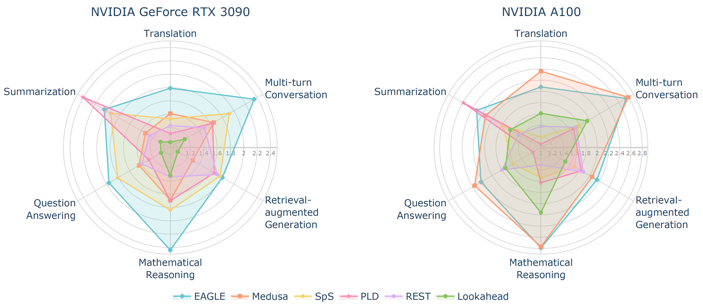

<div align="center">
  <h2><i>Spec-Bench:</i><br>A Comprehensive Benchmark for Speculative Decoding</h2> 
</div>

<p align="center">
| <a href="https://arxiv.org/abs/2401.07851"><b>Paper</b></a> | <a href="ROADMAP.md"><b>Roadmap</b></a> |
</p>



<div align="center">
<font color="gray">Speedup comparison of Speculative Decoding methods on Spec-Bench, evaluated by Vicuna-7B-v1.3.</font>
</div>

## Introduction

Spec-Bench is a comprehensive benchmark designed for assessing Speculative Decoding methods across diverse scenarios. This repository contains the dataset and all scripts to conduct evaluations on Spec-Bench, facilitating the assessment of forefront Speculative Decoding methods ***in the same device and testing environment***.

Currently, Spec-Bench supports the evaluation of the following open source models:

- [EAGLE](https://sites.google.com/view/eagle-llm)
- [Medusa](https://sites.google.com/view/medusa-llm)
- [Speculative Sampling](https://huggingface.co/blog/assisted-generation)
- [Prompt Lookup Decoding](https://github.com/apoorvumang/prompt-lookup-decoding)
- [REST](https://sites.google.com/view/rest-llm/)
- [Lookahead Decoding](https://lmsys.org/blog/2023-11-21-lookahead-decoding/)

## Installation

```
conda create -n specbench python=3.9
conda activate specbench
cd Spec_Bench
pip install -r requirements.txt
```

## Model Weights

Download corresponding model weights (if required) and modify the checkpoint path in `eval.sh`.

- [vicuna-v1.3](https://huggingface.co/lmsys/vicuna-7b-v1.3)
- [Medusa-1](https://github.com/FasterDecoding/Medusa?tab=readme-ov-file#medusa-1)
- [EAGLE](https://github.com/SafeAILab/EAGLE?tab=readme-ov-file#eagle-weights)

## Additonal Setup

#### REST (Optional)

**Build DraftRetriever from source**

```
cd model/rest/DraftRetriever
curl --proto '=https' --tlsv1.2 -sSf https://sh.rustup.rs | sh
maturin build --release --strip -i python3.9 # will produce a .whl file
pip3 install ./target/wheels/draftretriever-0.1.0-cp39-cp39-linux_x86_64.whl
```

##### Create a datastore

```
cd model/rest/datastore
./datastore.sh # modify your own path
```

## Inference

Select specific command line in `eval.sh`, the results will be stored in `data/spec_bench/model_answer/`.

```
./eval.sh
```

## Speedup Report

Obtain the corresponding speedup compared to vanilla autoregressive decoding.

```
python evaluation/speed.py --file-path /your_own_path/eagle.jsonl --base-path /your_own_path/vicuna.jsonl
```

## Result Comparison

Examine whether the generated results are equal to autoregressive decoding or not.

```
python evaluation/equal.py --file-path /your_own_path/model_answer/ --jsonfile1 vicuna.jsonl --jsonfile2 eagle.jsonl
```

## Contributing

We warmly welcome contributions and discussions related to Spec-Bench! If you have any suggestions for improvements or ideas you'd like to discuss, please don't hesitate to open an issue. This will allow us to collaborate and discuss your ideas in detail.

Additionally, if you're aware of any open-source Speculative Decoding methods not currently included in Spec-Bench, we encourage you to contribute by submitting a pull request. This helps ensure Spec-Bench remains a comprehensive and fair benchmarking platform for comparing existing methods. Please ensure that your changes are well-tested before submission.

## Acknowledgements

This codebase is built from [Medusa](https://github.com/FasterDecoding/Medusa) and [EAGLE](https://github.com/SafeAILab/EAGLE). We integrated code implementations of multiple open-source Speculative Decoding methods to facilitate unified evaluation.

## Citation

If you find the resources in this repository useful, please cite our paper:

```
@misc{xia2024unlocking,
      title={Unlocking Efficiency in Large Language Model Inference: A Comprehensive Survey of Speculative Decoding}, 
      author={Heming Xia and Zhe Yang and Qingxiu Dong and Peiyi Wang and Yongqi Li and Tao Ge and Tianyu Liu and Wenjie Li and Zhifang Sui},
      year={2024},
      eprint={2401.07851},
      archivePrefix={arXiv},
      primaryClass={cs.CL}
}
```

